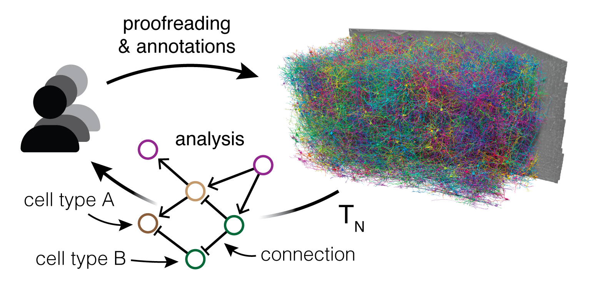

## Coding Modules:

The MICrONS dataset, spanning one cubic millimeter of mouse cortex, is comprised of petabytes of data from electron microscopy images at nanometer resolution, dense segmentation of 200,000 brain cells, half a billion synapses, and hundreds of thousands of other annotations to label the data.

To enable systematic analysis without downloading hundreds of gigabytes of data, users can selectively access cloud-based data programmatically through a collection of open source Python clients.

This collection of Ipython Notebooks introduces data access to the **Connectome Annotation Versioning Engin (CAVE).**

### Setting up data access

These notebooks are foundational for accessing the data, but only need to be completed once per user. There are two options: 

* **Cloud Access**, for setting up access in Google Colab
* **Local Analysis** setting up access for running on a local machine or JupyterHub. We recommend Cloud Access for intitial instruction and in-class work. Local analysis may be better for independent study and ongoing work.

::::{.grid}

:::{.g-col-6}

**Cloud Access with Google Colab**

  

:::

:::{.g-col-6}

**Local setup notebook**

 [Ipython Notebooks](notebooks/caveclient-setup-local.ipynb) 

:::

::::

