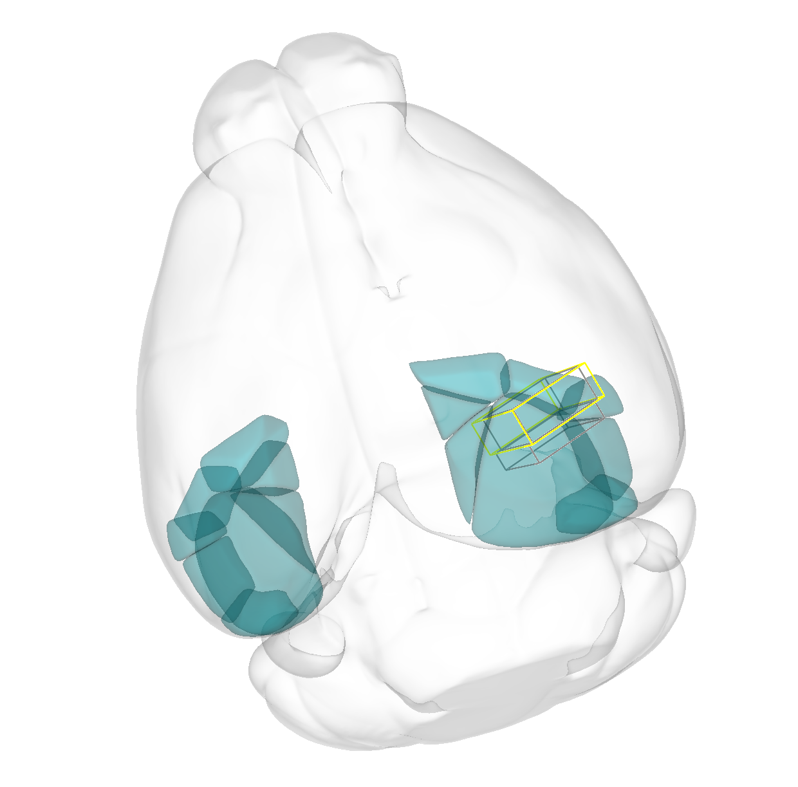
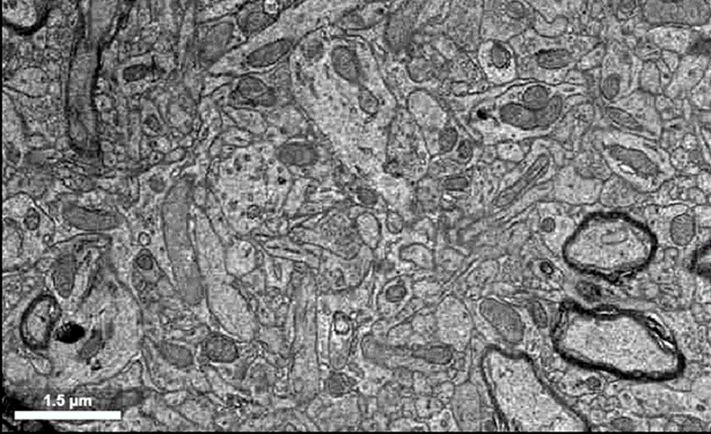
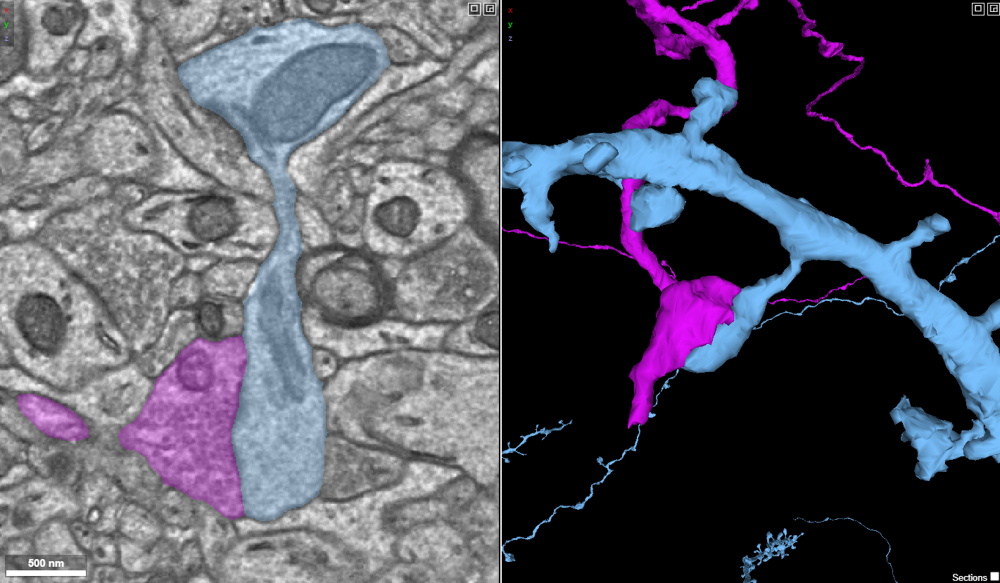
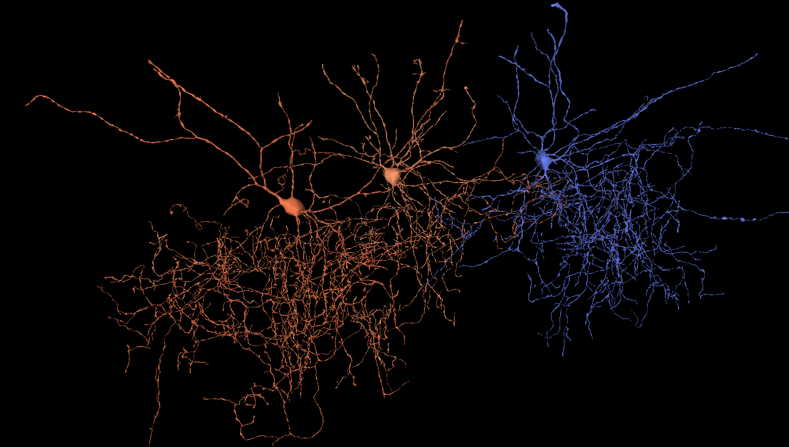

## Education Modules:

### Module 1: Neuroanatomy and Introduction to Neuroglancer
::::{.grid}

:::{.g-col-6}

 [Online module](module-1.html) 

 [PDF Download](module-1.pdf) 

:::

:::{.g-col-6}

In this neuroanatomy and introduction to Neuroglancer module, students delve into the neuroanatomy of the rodent visual cortex and receive an introduction to navigation in the Neuroglancer platform. 

Learning Goals:

* Use neuroanatomical direction terms to describe spatial relationships between neurons, axons, and dendrites  
* Observe the organization of visual cortex neurons into regions, columns, and layers that carry visual information  
* Navigate a connectomics data set within the Neuroglancer platform 
:::

::::

### Module 2: Ultrastructure and Cytology
::::{.grid}

:::{.g-col-6}

 [Online module](module-2.html) 

 [PDF Download](module-2.pdf) 

:::

:::{.g-col-6}

In this ultrastructure and cytology module, students delve into the intricate world of cellular structure at the nanoscale level. Neurons are specialized brain cells that are made up of cellular structures such as axons, dendrites, and cell bodies, but they also contain more general cellular organelles, like endoplasmic reticulum, that carry out the basic function of all cells. These structures and organelles work together to facilitate information flow and functionality throughout the nervous system. In this laboratory module, students will learn about the structural features of neurons, and how to identify them in electron microscopy data sets.  

:::

::::

### Module 3: Dendritic Spines and Synaptic Integration
::::{.grid}

:::{.g-col-6}

 [Online module](module-3.html) 

 [PDF Download](module-3.pdf) 

:::

:::{.g-col-6}

This laboratory module introduces students to the structure-function relationship of dendritic spines using large-scale volumetric electron microscopy (EM) data. Students will use Neuroglancer to explore the MICrONS EM dataset, allowing them to identify and classify dendritic spines, in addition to examining how dendritic spine morphology varies across synapses. Through guided analysis, this module emphasizes how differences in spine shape, size, and connectivity relate to synaptic strength and circuit connectivity, providing hands-on experience with modern connectomics tools and quantitative neuroanatomy. 

:::

::::

### Module 4: Neuron Types and Dash Apps
::::{.grid}

:::{.g-col-6}

 [Online module](module-4.html) 

 [PDF Download](module-4.pdf) 

:::

:::{.g-col-6}

This lab module provides an introduction to the different types of neurons that populate the cortex and the patterns of connectivity between them. Students will explore neurons of different types using the Neuroglancer browser and Dash Apps that allow all the neurons in the MICrONS dataset to be queried based on their type, classification, and other metadata. Particular focus will be on the connectivity patterns of major inhibitory interneuron types, such as Basket Cells and Chandelier Cells.

:::

::::