  

{fig-align="center"}


## Overview

In this neuroanatomy and introduction to Neuroglancer module, students delve into the neuroanatomy of the rodent visual cortex and receive an introduction to navigation in the NeuroGlancer platform. 

## Learning Goals 

* Use neuroanatomical direction terms to describe spatial relationships between neurons, axons, and dendrites  
* Observe the organization of visual cortex neurons into regions, columns, and layers that carry visual information  
* Navigate a connectomics data set within the NeuroGlancer platform 

## Background and Introduction 

In this module, you will use the Neuroglancer software to navigate an open-access data set that was created by the Machine Intelligence from Cortical Networks (MICrONS) program, which sought to use reverse engineer brain circuits to improve the ability of computers to recognize patterns. This dataset consists of a cubic millimeter of mouse visual cortex that was sliced into 28,000 serial sections (Figure 1). These slices were imaged using transmission electron microscopy, and the images were assembled into a three-dimensional volume. This dataset has allowed scientists to reconstruct three-dimensional models of neurons from the electron microscopy data and analyze patterns of synaptic connections between the neurons. In total, the dataset contains 200,000 cells and over 500 million synapses [@the_microns_consortium_functional_2025].

 


## Organization of the Visual Cortex 

The primary visual cortex receives visual information from the dorsal lateral geniculate nucleus of the thalamus via thalamocortical axons. Neurons in the cortex are organized into columns and layers (Figure 2). In the visual cortex, columns consist of neurons through the depth of the cortex that share a visual receptive field and preferred stimulus properties, while layers consist of neurons that share similarities in their neuron type (e.g. excitatory versus inhibitory) and patterns of connectivity. In general, neurons in Layer 4 receive the majority of the synapses coming from the lateral geniculate nucleus, while excitatory Layer 3 neurons send axons out into other cortical areas. Excitatory neurons in Layers 5 and 6 send axons carrying feedback into lateral geniculate nucleus and other areas. About 20% of neurons in all layers are inhibitory interneurons that make local synaptic connections (i.e. don’t send out or receive synapses from other brain regions). 


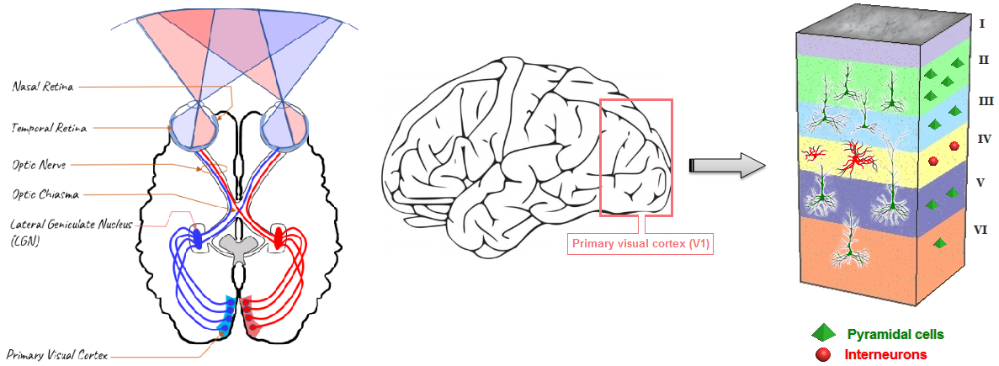{fig-align="center"}


In general, neurons in Layer 4 receive the majority of the synapses coming from the lateral geniculate nucleus, while excitatory Layer 3 neurons send axons out into other cortical areas. Excitatory neurons in Layers 5 and 6 send axons carrying feedback into lateral geniculate nucleus and other areas. About 20% of neurons in all layers are inhibitory interneurons that make local synaptic connections (i.e. don’t send out or receive synapses from other brain regions).

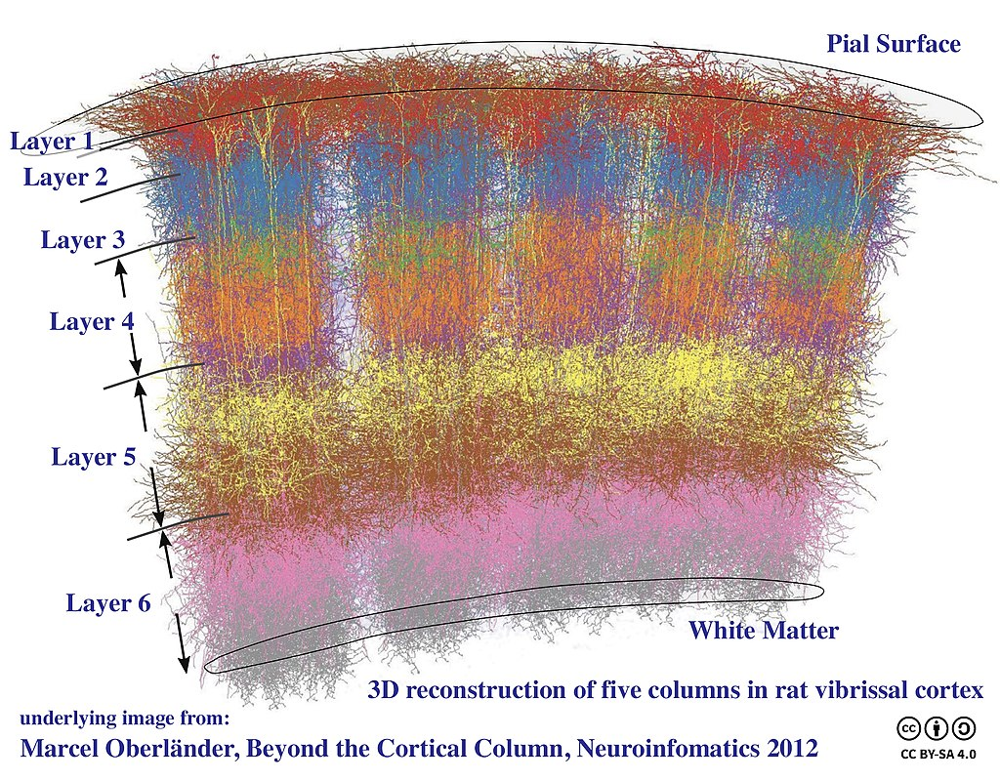


## Neuroanatomy Direction Terms

To work effectively with this neuroanatomical dataset, you will need to have a clear understanding of anatomical direction terms and how they relate to the nervous system of a rodent and to that of a human. 
The body axis and neuraxis of organisms with four or more legs, such as dogs or rodents, share the same plane. This differs from the human body, in which the neuroaxis is rotated 90° from the plane of the body axis (Figure X).  


Because many parts of the vertebrate brain have a layered organization, scientists also use neuroanatomical direction terms that describe the positions of cells or cellular structures related to the layers of the brain.

![Figure 4. Layered organization of the cortex and apical/basal organization of neurons.(Adapted from Springer Nature Encyclodia of Neuroscience and [@Bekkers_2011])](resources/bekkers_pyramidal_layers.png)


## Protocol

The first section of this protocol will give you an opportunity to become familiar with anatomical direction terms and how they apply to the mouse nervous system.

### 1.	Describing Neuroanatomy Direction Terms

[Define the direction associated with each of the anatomical direction terms listed below:]{.mark}

a.	anterior –
b.	posterior – 
c.	dorsal – 
d.	ventral –  
e.	medial – 
f. 	lateral –

[Compare the neuroanatomical direction terms in each of the following sets.]{.mark}

a.	Superficial versus Deep
b.	Basal versus Apical


### 2.  Visualizing Neuroanatomy Direction Terms

We will use the NeuroGlancer browser to observe how these neuroanatomical direction terms can be used to describe the spatial relationships between neurons and neural structures in the visual cortex.

Access NeuroGlancer by clicking on the following link:

> <https://spelunker.cave-explorer.org/#!middleauth+https://global.daf-apis.com/nglstate/api/v1/4793806474969088>


:::{.callout-tip}
You may be prompted to provide a Google login. This should only be required the first time you access the site.
:::

You should see the following screen: 

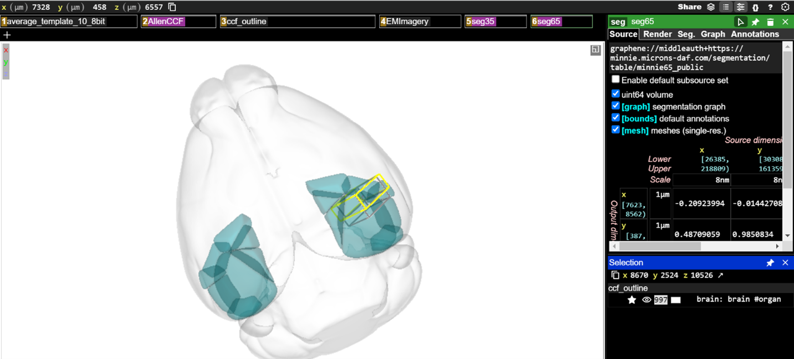{fig-align="center"}

:::{.callout-caution}
MICrONS Terms of Service Error

If the neuroglancer does not render, follow these steps:

1)	Go here: <https://global.daf-apis.com/sticky_auth/api/v1/tos/2/accept> to accept terms of service on your google authorized account
2)	Once you have logged in through google and accepted the terms of service your login will be valid for neuroglancer. 
:::


The main viewing pane shows a three-dimensional model of the mouse brain (light gray shading). The visual cortex regions acquired by the MICrONS data set are shown as blue-green objects in the brain volume. The dimensions of the MICrONS data are indicated by the yellow and gray boxes located in the visual cortex. 

The boxes across the top of the main viewing pane are known as layer tabs. These allow the different visual elements in the main viewing pane to be selected or turned on and off. You can  the “ccf_outline” to turn the whole-brain volume element on and off in the viewing pane or  on the “AllenCCF” tab to turn the visual cortex elements on and off in the viewing pane.

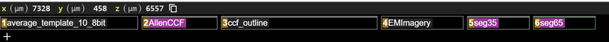{fig-align="center"}

To the left of the main viewing pane is a panel that lets you adjust the settings for each visual element.  any of the layer tabs will bring up its settings in the options panels on the right-hand side of the display.

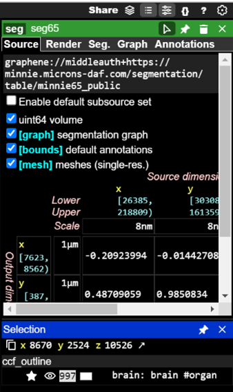{fig-align="right"}

Visual elements in NeuroGlancer are described as segments. Every reconstructed neuron in the data set has a unique Segment ID. Now, you will add neuron segments to the viewer using their Segment IDs. First,  on the `6seg65` layer tab to bring up a list of display options in the options panel.  on the Seg tab in the right-hand panel to select it. Segment IDs can be pasted into the text box that says “Enter ID, name prefix or /regexp” to add them to a list of segments available to be viewed.

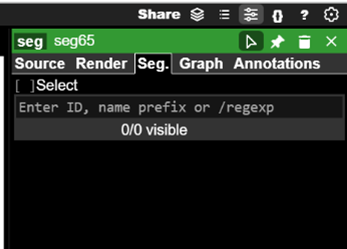{fig-align="right"}


Paste the following Segment IDs into the text box one at a time and press Enter after each (Hint: You can also copy and paste the entire list at the same time): 

```python
864691134885139194
864691135938336309
864691135441796936
864691136521574801
864691135684989623
864691135693657023
864691136123773222
864691135617972371
864691136031763387
```


After each Segment ID is added, click the small eye icon to the left of the Segment ID when it shows up on the list. This will make a three-dimensional model of the neuron visible in the main viewing pane.

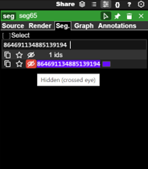{fig-align="right"}

Once you have added each of the neurons to the viewer, you will need to navigate the main viewing pane to see the neuron segments. 

* You can rotate the view by  and dragging the mouse pointer 
* You can slide the view by  and dragging your mouse pointer
* You can zoom the view in small increments by using the 
* You can zoom the view in large increments by holding  and using the 
* You can also  on any of the segment IDs listed in the options panel to center the via on that neuron segment (if you are zoomed far out, this may not be obvious)

Try to zoom in to the yellow and gray boxes so you can see the three-dimensional reconstructions of the neurons you have added. You should be able to see something like this in the main viewing pane. 

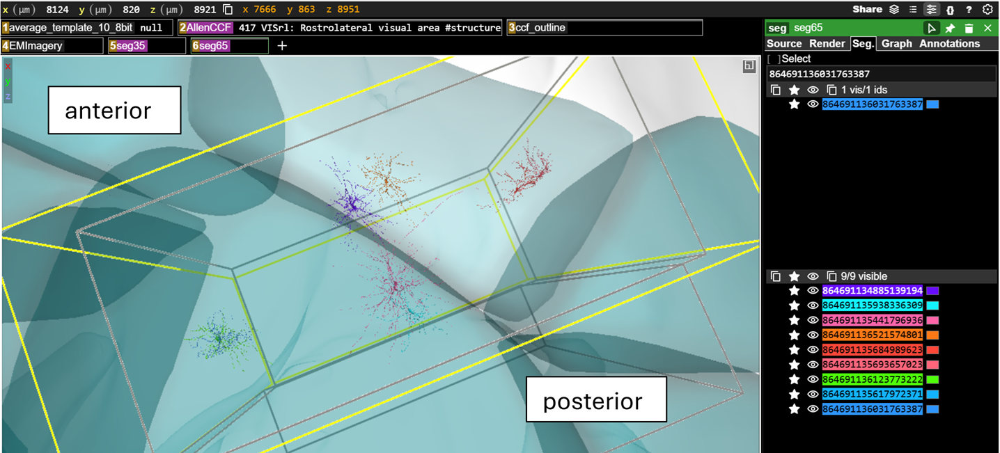{fig-align="center"}


If you hover over any of the segment IDs listed in the options panel with your mouse pointer, the three-dimensional model of that neuron will also be highlighted in the viewing pane. This also works in reverse, if you hover your mouse pointer over any of the models in the viewing pane, the segment ID will be highlighted in the right-hand options panel.

Now you will compare the neuroanatomical positions of the neurons you have added to the browser. You may have to rotate the view and/or zoom out and then back in to see the positions of the neurons relative to the rest of the brain. [For each of the following pairs of cells, indicated which is anterior and which is posterior:]{.mark}  

:::{.callout-tip}
Hint: None of the neurons have the same final four digits – so you can use those to search for each neuron in the list
:::

|                       |                       |  
| --------------------- | --------------------- |  
|  **Neuron Name**     | **Anterior / Posterior**          | 
| `864691134885139194`, `864691135441796936` |           | 
| `864691135938336309`, `864691136521574801` |           | 

: {.bordered tbl-colwidths="[60,40]"}

<br>
<br>


[For each of the following pairs of cells, indicate which is medial and which is lateral:]{.mark}

|                       |                       |  
| --------------------- | --------------------- |  
|  **Neuron Name**     | **Medial / Lateral**          | 
| `864691135684989623`, `864691136123773222` |           | 
| `864691136031763387`, `864691135693657023` |           | 

: {.bordered tbl-colwidths="[60,40]"}

<br>
<br>


[For each of the following pairs of cells, indicate which is dorsal and which is ventral:]{.mark}

|                       |                       |  
| --------------------- | --------------------- |  
|  **Neuron Name**     | **Dorsal / Ventral**          | 
| `864691135441796936`, `864691136521574801` |           | 
| `864691135693657023`, `864691135684989623` |           | 

: {.bordered tbl-colwidths="[60,40]"}

<br>
<br>


### 3.  Layered organization of visual cortex

As described above, the visual cortex is divided into layers. Each layer contains specific types of neurons, each with their own shape, size, and pattern of connections. In this section, you will visualize and describe the neurons in different layers of the cortex.

First, click on the following link to open a new NeuroGlancer window:

> <https://spelunker.cave-explorer.org/#!middleauth+https://global.daf-apis.com/nglstate/api/v1/6518965183447040>  

You should see something like this:

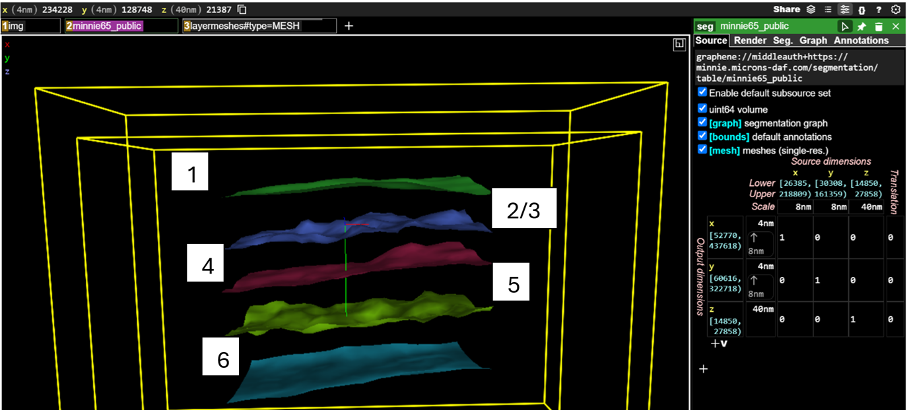{fig-align="center"}

1. Green mesh = boundary between Layer 1 and Layer 2/3  
2. Blue mesh = boundary between Layer 2/3 and Layer 4  
3. Red mesh = boundary between Layer 4 and Layer 5 
4. Yellow mesh = boundary between Layer 5 and Layer 6
5. Teal mesh = boundary between Layer 6 and white matter

Now, you will again add neuron segments to the viewer using their Segment IDs. First,  on the `2minnie65_public` layer tab to bring up a list of display options in the options panel.  on the Seg tab in the right-hand panel to select it. You will again be pasting segment IDs into the text box that says “Enter ID, name prefix or /regexp” to add them to a list of segments available to be viewed.

Paste the following Segment IDs into the text box one at a time (Hint: You can also copy and paste the entire list at the same time): 

```python
864691134885139194  
864691135938336309  
864691135441796936  
864691136521574801  
864691135684989623  
864691135693657023  
864691136123773222  
864691135617972371  
864691136031763387  
```

As you did before, after each Segment ID is added, click the small eye icon to the left of the Segment ID when it shows up on the list. This will make a three-dimensional model of the neuron visible in the main viewing pane. You should see this after you have added and made visible all the neuron segments.

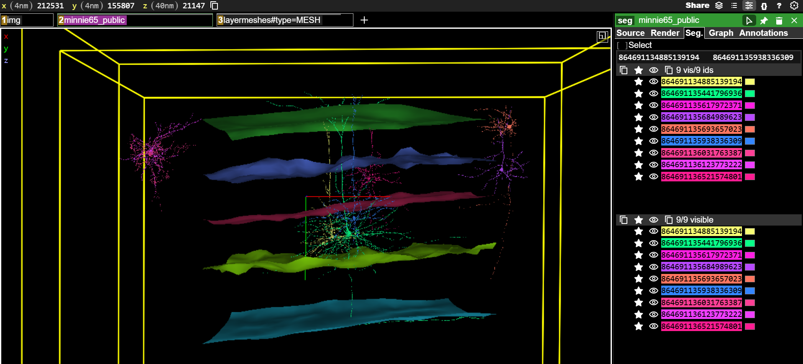{fig-align="center"}


[For each of the following pairs of cells, indicate which has its cell body in a more superficial layer and which has its cell body in a deeper layer:]{.mark}  


|                       |                       |  
| --------------------- | --------------------- |  
|  **Neuron Name**     | **Superficial / Deep**          | 
| `864691136123773222`, `864691136521574801` |           | 
| `864691135684989623`, `864691135693657023` |           | 

: {.bordered tbl-colwidths="[60,40]"}


<br>
<br>

[For the following neurons, indicate which cortical layer the cell body is located in:]{.mark}  


|                    |                       |  
| ------------------ | --------------------- |  
| **Neuron Name**      | **Cell Body Layer** |  
| `864691135441796936` |                       |  
| `864691135684989623` |                       |  
| `864691136123773222` |                       |  
| `864691135938336309` |                       |  

: {.bordered tbl-colwidths="[40,60]"}


<br>
<br>

Pyramidal neurons are the primary excitatory neurons that carry visual information within the visual cortex and out to other brain regions (Figure 5). Pyramidal cells typically have a single axon that may branch extensively and two distinct groups of dendrites that can be classified as apical and basal. Apical dendrites project towards the superficial layers of the cortex. Basal dendrites project outward from the cell body of the neuron.

![Figure 5. A Layer 5 cortical pyramidal neuron. (after [@Bekkers_2011])](resources/bekkers_pyramidal_crop.png)

In the right-options panel, click the eye icons to make only the 864691135441796936 neuron segment visible. Zoom and rotate the view in the main viewing pane until the neuron is oriented as follows

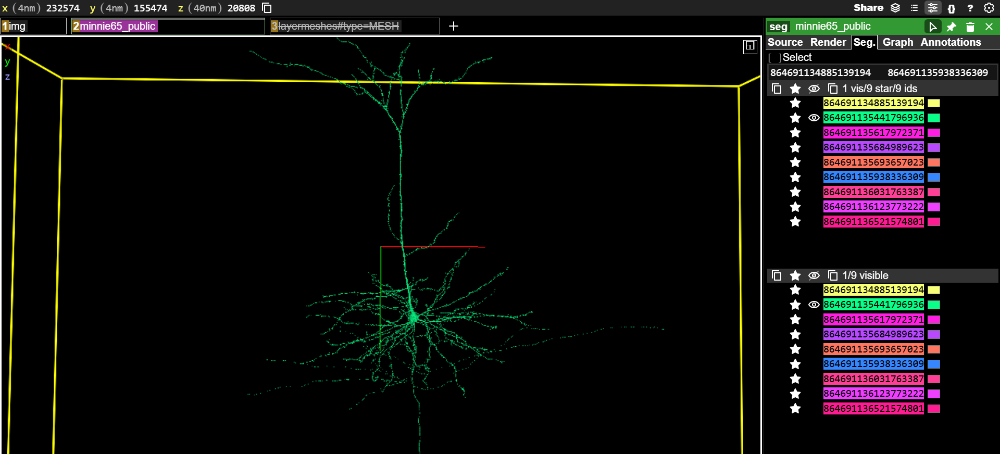{fig-align="center"}

[Take a screenshot of the neuron and use it to make a figure for your assignment. Label the figure to indicate the position of the cell body, axon, apical dendrite, and basal dendrite.]{.mark} (Note: In the image above, we have toggled off the layer boundaries.)  

<br>
<br>

### 4. Visualizing the flow of information through the visual cortex

We will now look at how neurons are organized into columns and layers in order to begin to understand how the visual cortex is wired and how visual information flows through the brain. First, you should click on the following link:

> <https://spelunker.cave-explorer.org/#!middleauth+https://global.daf-apis.com/nglstate/api/v1/5142016942931968> 

When this link opens, you should see the layer boundaries and several three-dimensional neuron models present in the main viewing pane. If you use your mouse to slide and rotate around these models, you will see that these neurons are organized into two groups. These represent cortical columns, groups of neurons that span all six cortical layers and that respond to stimuli with specific coordinates within the visual field.
-Click >}} on the “V1_cylinder” and “HVA_cylinder” tabs above the main viewing pane. This will call up two sets of column boundaries (Figure 6). In this case, V1 indicates a column in the primary visual cortex and HVA indicates a column in a higher-order visual area, which is a cortical area that receives information coming from the primary visual cortex.

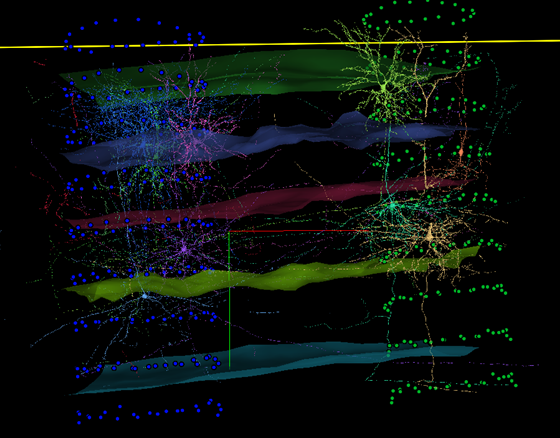

We also have visual aids that will help us see the boundaries between cortical regions. At this point,  the “V1_cylinder” and “HVA_cylinder” tabs above the main viewing pane to remove the column visualizations. 

Now click the “areameshes” tab to call up a visualization that shows the rough boundaries between primary visual cortex and higher-order visual cortical regions. In the picture below, the area to the left is primary visual cortex, while the areas to the right are higher-order visual cortex areas that receive information from primary visual cortex (Figure 7). You may need to rotate your view in the main viewing pane to view all of the region borders that are represented.

For questions that follow, you can  the tabs above the main viewing pane to add or remove the column and boundary visualizations as needed.


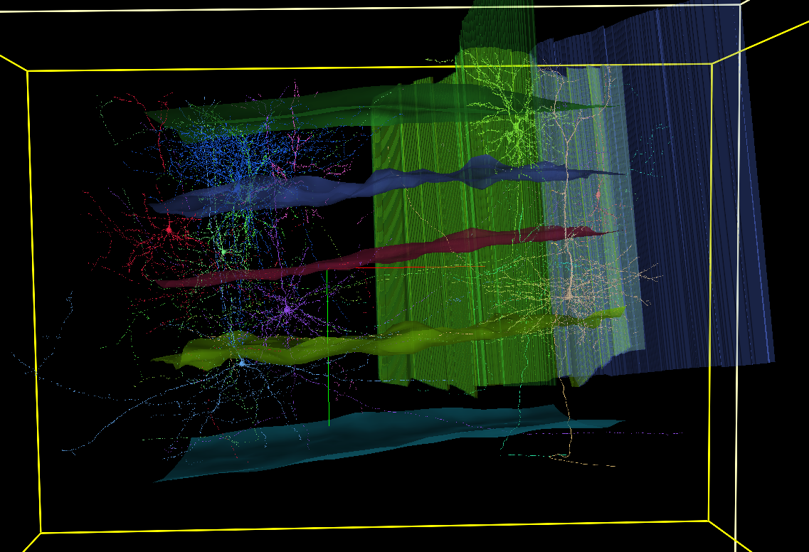


For the next section, you may want to reset your NeuroGlancer window by clicking on the following link:

> <https://spelunker.cave-explorer.org/#!middleauth+https://global.daf-apis.com/nglstate/api/v1/5142016942931968>  

We are now going to analyze the organization and connections of some cortical neurons. First,  on the `2minnie65_public layer` tab above the main viewing pane. Then,  on the Seg tab at the top of the right-hand settings panel. In the bottom left, you should see a list of neuron Segment ID numbers corresponding to each of the neuron models seen in the main viewing pane. You can change the visibility of each neuron with  on the eye icon next to each Segment ID. You can change the color of each neuron by clicking the color swatch to the right of each Segment ID.

For this final bit of data collection, you are asked to identify the brain region and layer that each neuron’s cell body is in. You are also asked to determine where the axon of each neuron project to and what the function of that neuron probably is. In the image and table below, there is an example of how these data were collected for the 864691134988722810 neuron. 

In the image, every neuron except for 864691134988722810 was made invisible (Figure 8). This allows us to observe that the cell body of this neuron is located in Layer 2/3 of the V1 column. So, we have indicated Primary Visual Cortex and Layer 2/3 in the table. We can see that the axons of this neuron travel to the HVA column. This means that this is cortico-cortical projection neuron carrying information from one cortical area to another. We have entered this in the table as well.

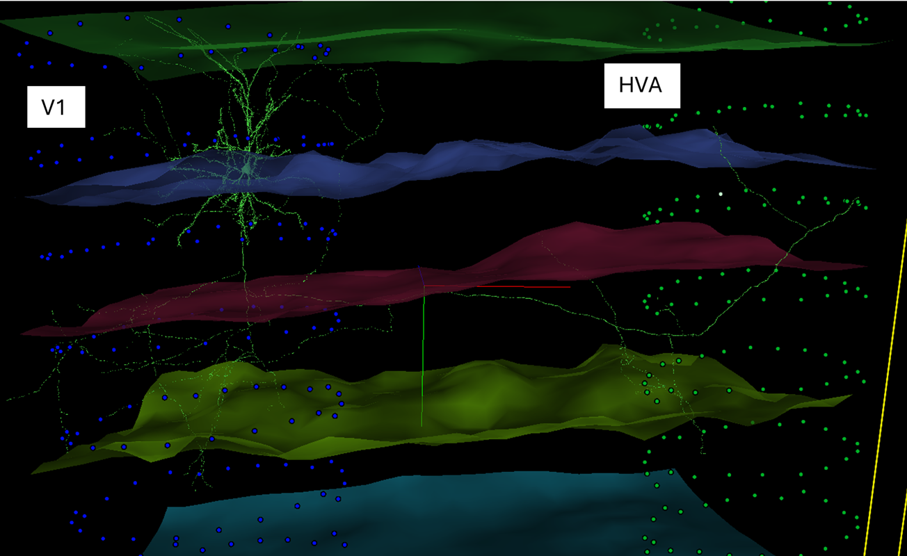

[You will now fill out the table for each other neuron.]{.mark} Here are some hints to consider:

* You may need to make some neurons not visible or change neuron colors in order to see what each neuron is doing  
* Each neuron will either be in Primary visual cortex or a Higher-order visual area.  
* Remember that the layer boundaries are described earlier in this document and that you are looking for the layer containing the cell body of the neuron
* You may need to distinguish axons from dendrites. For most neurons in this group, the easiest way to do this is to look for spines that signify dendrites (Figure 9). Axons will generally be smooth, rather than spiny.
* Neurons may target multiple areas. These include other columns as shown above. Other neurons may send axon branches into the white matter (below the most ventral layer boundary) or have branches that stay within the same column. For these cases, you could suggest that the neuron is targeting subcortical regions (for axons that enter the white matter) or local neurons (for neurons that branch within the same column).
* Neurons that send axons into other columns are cortico-cortical projection neurons. Neurons that send axons into subcortical regions can be proposed to be cortico-thalamic neurons. Neurons that branch locally can be proposed to be local interneurons.

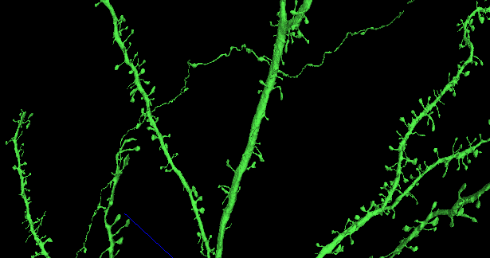


|                    |                       |                     |                 |                             |
| ------------------ | --------------------- | ------------------- | --------------- | --------------------------- |
| **Neuron Name**    | **Brain Region**      | **Cell Body Layer** | **Axon Target** | **Proposed Function**       |
| `864691134988722810` | Primary visual cortex | Layer 2/3           | HVA Column      | Cortico-cortical projection |
| `864691135367058169` |                       |                     |                 |                             |
| `864691135508871945` |                       |                     |                 |                             |
| `864691135584074360` |                       |                     |                 |                             |
| `864691135609594119` |                       |                     |                 |                             |
| `864691135753932237` |                       |                     |                 |                             |
| `864691135782544435` |                       |                     |                 |                             |
| `864691136008689326` |                       |                     |                 |                             |
| `864691136023889209` |                       |                     |                 |                             |
| `864691136134707851` |                       |                     |                 |                             |
| `864691136662432990` |                       |                     |                 |                             |

: {.bordered}

<br>
<br>

## Additional Resources

You can explore the MICrONS dataset further at:
[MICrONS-Explorer.org](https://www.microns-explorer.org/cortical-mm3)

## Works Cited
