  

{fig-align="center"}

## Overview

In this ultrastructure and cytology module, students delve into the intricate world of cellular structure at the nanoscale level. Neurons are specialized brain cells that are made up of cellular structures such as axons, dendrites, and cell bodies, but they also contain more general cellular organelles, like endoplasmic reticulum, that carry out the basic function of all cells. These structures and organelles work together to facilitate information flow and functionality throughout the nervous system. In this laboratory module, students will learn about the structural features of neurons, and how to identify them in electron microscopy data sets. 

## Learning Goals 

After completing this module you will be able to:
 
* Engage with the electron micrograph browser of NeuroGlancer and associated layers and panels.
* Identify organelles such as nuclei, mitochondria, and endoplasmic reticulum in electron microscopy data sets. Additionally, you will be able to identify synaptic ultrastructural features such as vesicles, postsynaptic densities, and synaptic clefts.
* Explain and discuss how specific organelles and ultrastructure contribute to the specialized functions of axons, dendrites, cell bodies, and synapses.

## Background and Introduction 

### Neuron Structure

Neurons are polarized cells in the brain that contain specialized processes such as axons and dendrites that extend from a central cell body (Figure 1). This polarization allows for information, in the form of graded electrical potentials, to be carried from postsynaptic synapses on the dendrites towards the cell body to initiate action potentials at the axon hillock. Action potentials will then be carried along the axon towards the axon terminals to evoke neurotransmitter release. All of these parts of a neuron (axons, dendrites, cell body, synapses) can be observed in electron micrographs of the nervous system. Because these different structures have specialized functions that contribute in different ways to neuronal signaling, they also differ in their structures and contents. In this lab, you will learn how to identify different neuronal structures, and consider the ways that their content reflect different functions.

![Figure 1. (A) Schematic representation of the cell body, dendrites, and axon of a neuron. (B) Representation of a neuron’s interactions with other nervous system cell types. Source: [@Luo2016principles] ](resources/luo_neuron_schematic.png) 

### Organelles and Neuronal Ultrastructure

Using electron microscopy, we can observe and identify the organelles that support the function of a neuron. These organelles may include: the nucleus, which houses DNA and is the site of transcription and RNA processing; the endoplasmic reticulum, which is a site of protein synthesis and folding; and mitochondria, the so-called powerhouses of the cell. We can also identify other organelles and cell structures such as the cytoskeleton, in addition to features that define a synapse. In this lab section, you will identify these and other structures and consider their contributions to neuronal function.

## Laboratory Module

### Navigating Neuroglancer panels

We will be working within the NeuroGlancer browser to identify ultrastructural features within the electron micrographic dataset. You can access NeuroGlancer by clicking on this link or by copying and pasting the following text into your browser:

> <https://spelunker.cave-explorer.org/#!middleauth+https://global.daf-apis.com/nglstate/api/v1/5957188943085568>

:::{.callout-tip}
You may be prompted to provide a Google login. Please login with your e-mail address.
:::

Once logged in, you should see the following screen:

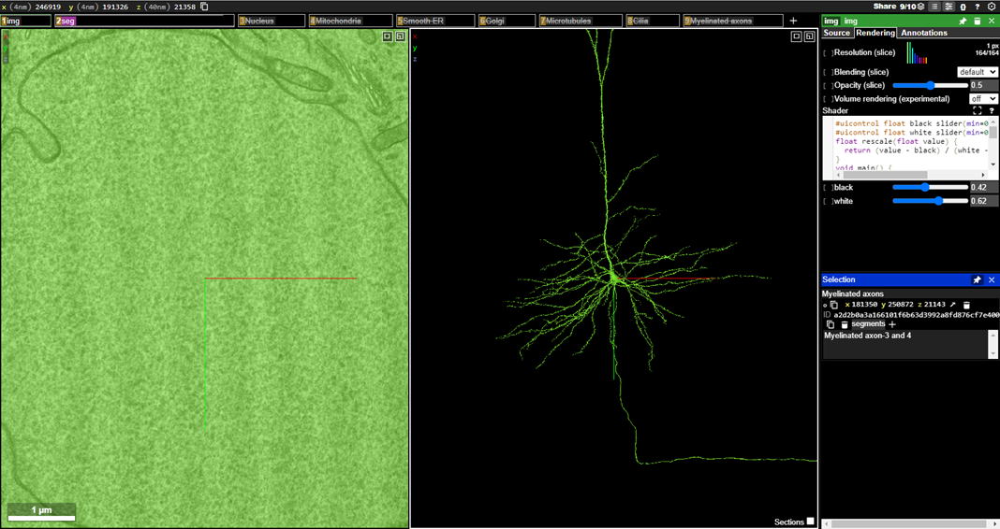{fig-align="center"}

:::{.callout-caution}
MICrONS Terms of Service Error

If the neuroglancer does not render, follow these steps:

1)	Go here: <https://global.daf-apis.com/sticky_auth/api/v1/tos/2/accept> to accept terms of service on your google authorized account
2)	Once you have logged in through google and accepted the terms of service your login will be valid for neuroglancer. 
:::

To orient yourself, the left-most panel displays the electron micrographic (EM) images. This is the raw data generated from the cutting, sectioning, staining, and imaging of the one micrometer cubed chunk of mouse visual cortex that serves as the basis of this dataset. 

:::{.callout-tip}
In the left-most panel, you are looking directly into the nucleus of a neuron, and the middle panel shows you the morphology of that neuron reconstructed in its entirety. 
:::

In NeuroGlancer, the middle panel displays the 3D segmentation of the neurons and glial cells that are clicked on within the raw EM images. The neuron you are looking at is a pyramidal neuron within visual cortex. Notice the elaborate dendritic arbor (with one long apical dendrite), and a thin axon that extends out from the bottom of the soma. 

Notice the boxes across the top of the main EM viewing panel. These are called **layer** tabs, and the `img` tab is the raw EM image panel:

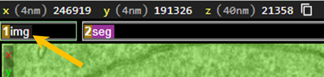{fig-align="center"}

You can activate different panels with  on the different layer tabs.  When you right-click on each layer tab, you will bring up the settings for that panel in the options panels on the far right-hand side of the display:

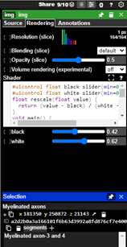{fig-align="right"}

If you  the layer tab, you will turn off that panel – you can  it again to toggle it back on. Currently, there are multiple tabs that have been turned “off” - indicated by a line strikethrough of the tab title. Be careful not to click on the “x” or the trashcan as that will remove the layer from the view totally, and we do not want to do that.

### Navigating within the main viewing panel

Within the center viewing panel, you should see a 3D reconstruction of a pyramidal neuron. Note the long apical dendrite extending from the top of the cell body and the axon extending out from the bottom:

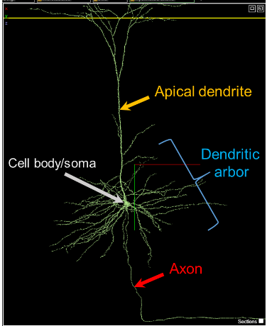{fig-align="center"}

You can engage with the neuron in the main viewing panel by using the following commands:

* Jump to a location with 
* You can rotate the 3D view by  and dragging the mouse pointer 
* You can slide (pan) the 3D view by  and dragging your mouse pointer
* You can zoom into the neuron by holding  and using the  (or by holding  and pressing  or , if using a keyboard)

Take a moment to play around with these controls to familiarize yourself with how to interface with the viewing panel and rotate the neuron within the layer.

:::{.callout-caution}
The controls have slightly different functions in 2D or 3D. If you  in 3D, you 'pan' the view left and right. If you  in 2D you rotate the section view. 

Because this data is *anisotropic*, it has a different 'thickness' when turned on its side than when face on. Generally, you do not want your 2D plane to rotate. If you do accidentally, you can reset to coordinate axes by hovering your mouse over the 2D pane and hitting 
:::

### Navigating within the Electron Microscopy (EM) raw data

You can engage with the raw electron micrographic images in the left-most viewing panel by using the following commands:

* You can slide (pan) the 2D view view by  and dragging the mouse pointer 
* You can zoom out and into the 2D image by holding  and using the  on your mouse (or by holding  and pressing  or , if using a keyboard)
* You can step through the raw data in the z-direction by using the  on your mouse, or pressing  or , if using a keyboard)

:::{.callout-tip}
Try toggling the section overlay in 3D with keyboard , to see the representation of your 2D slice in space.
:::

### In-Class Student Activities 

It is now time for you to begin exploring the electron micrographic images of this dataset. In the following exercises, you will be presented with several examples of organelles within the raw electron microscopic images, and you will be tasked with finding additional examples of each organelle as an exercise. 

#### A. Nucleus

The nucleus of the cell is the organelle where the DNA is housed, and where gene transcription is carried out. An electron micrographic image of a nucleus is shown below: 

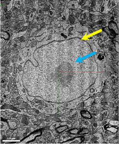{fig-align="center"}

Note that the blue arrow is pointing to the internal part of the nucleus, and the yellow arrow is pointing to the well-defined neuronal membrane. Notice that all of the surrounding axons and dendrites are quite small compared to the nucleus.

We have pre-identified three nuclei within the dataset for you to navigate to. To activate the layer that houses the nuclei   on the layer labeled “Nucleus” to activate the annotation layer: 

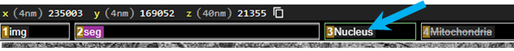{fig-align="center"}

Navigate to the Annotation panel on the right:

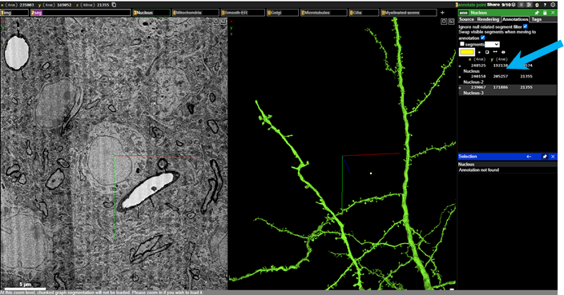{fig-align="center"}

The three pre-selected nuclei are listed under `Annotations` and you can move between the three nuclei by  on the each annotation. Explore through the three nuclei to get a sense for what the neuronal nuclei like. Use  wheel on your mouse to zoom in and out of the raw data to get a sense of what they look like (or by holding  and pressing  or , if using a keyboard).

Notice that there is a scale bar in the bottom left corner of the image. The scale bar will change as you zoom in and out, and if you drag the raw image by   and dragging, you can move the image so that the structure you are interested in is adjacent to the scale bar (see below).

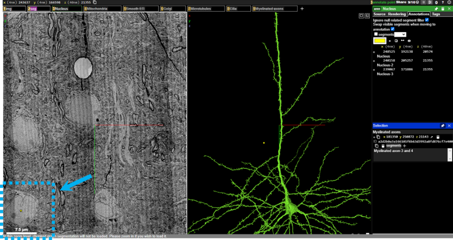{fig-align="center"}

Now, it’s your turn to find some nuclei in the data set. Scan around the raw EM image viewer by  dragging (move in xy),  (move in z), (zoom), and identify three additional nuclei in the dataset. You can annotate these structures yourself by clicking on the point annotator in the Annotations tab on the right, and then holding  clicking on the raw EM image. This will make an annotation point on the structure you click on, and you will see a new annotation will be added to the annotation panel on the right.

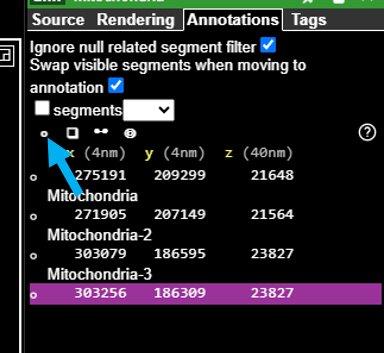{fig-align="right"}

Once you have annotated the nucleus, determine the approximate size of each nucleus, using the scale bar.  on the new annotation coordinates in the annotation panel, and then add the approximate size of the nucleus into the description field that is linked to that specific annotation. Don’t forget to include units! Repeat the annotation and size estimation for all three nuclei that you find. 

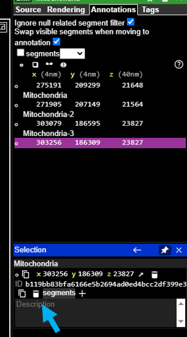{fig-align="right"}

#### B.	Mitochondria

The mitochondria are commonly referred to as the “powerhouses” of the cell. These membrane-bound organelles are responsible for generating energy in the form of adenosine triphosphate (ATP) through a process called cellular respiration (see image below, blue arrow). Found in most eukaryotic cells, mitochondria have a unique double-membrane structure and contain their own DNA, allowing them to produce some of their own proteins. Neurons rely on the generated ATP to run the Na+/K+ pump and mitochondria are often localized near synapses to provide the energy required for synaptic transmission.

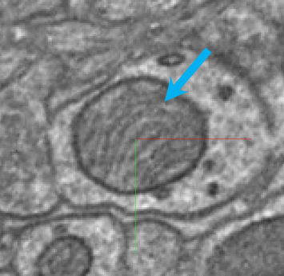{fig-align="center"}

To navigate to the pre-selected mitochondria,  to reveal the `Mitochondria` layer

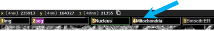{fig-align="center"}

Then, importantly, you must  on that same layer to activate the mitochondria annotations that have been pre-selected for you:

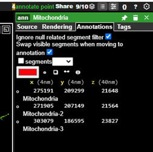{fig-align="right"}

You can  on the mitochondria annotations to observe these mitochondria.

:::{.callout-tip}
You can adjust the brightness and contrast of the imagery layer by activating the 'Shader Control' sub menu from the `Tool Palette`

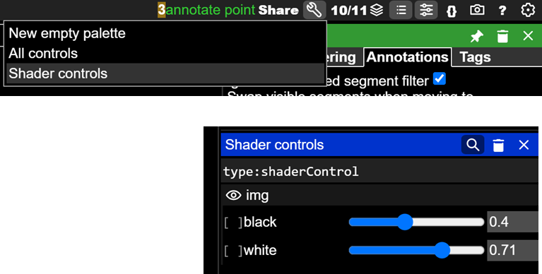{fig-align="right"}
:::

After you get a sense for what mitochondria look like, it is your turn to find some more. 

[Find three more mitochondria in the dataset, click on the point annotation tool and hold  on the raw EM image, and add an annotation point to the mitochondria you have found.]{.mark} Then, add an estimation of its size in the description field for each annotation.   

#### C. Smooth ER

The smooth endoplasmic reticulum (SER) is characterized by its tubular structure and lack of ribosomes on its surface, distinguishing it from the rough endoplasmic reticulum (see image below, blue arrow). The SER is often found in the soma of neurons and plays a key role in lipid synthesis and metabolism of carbohydrates. It is also important for calcium ion storage, such that when you hear about calcium being released from intracellular stores, it is the SER from which these ions are released into the cytosol. 

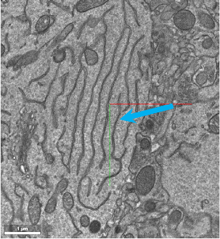{fig-align="center"}

There are, again, three examples of smooth ER pre-selected for you in the Annotation layer.  to reveal the `Smooth ER` layer:

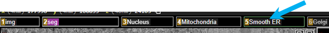{fig-align="center"}

Then  on that same layer tab to activate the smooth ER annotations in the Annotations panel.

 on each of the annotations to center the smooth ER in the image viewer. Zoom in and out to get a sense for where this organelle is found. It is typically found within the soma of neurons, adjacent to the nucleus.

After you get a sense for what smooth ER looks like, it is your turn to find some more. 

[Find three more smooth ER in the dataset, and annotate them using the annotation point tool and holding  ]{.mark} . For each smooth ER, you should determine their approximate size (estimate total width of smooth ER in the plane of section), and place that estimation in the description field for each annotation.

#### D.	Golgi apparatus

The Golgi apparatus is responsible for modifying, sorting, and packaging proteins and lipids for transport to various locations within the cell, and is vital for maintaining cellular function. It appears as stacked membranes in the electron microscopy raw images (see image below, blue arrow).

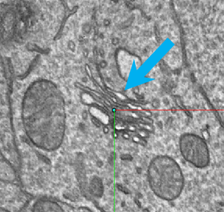{fig-align="center"}

We have pre-selected three examples of golgi apparatus for you in the Annotation layer.   on the `Golgi` layer:

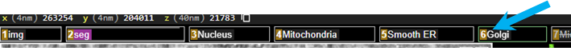{fig-align="center"}

Then  on that same layer tab to activate the golgi apparatus annotations in the Annotations panel.

  on each of the golgi apparatus annotations to center the golgi apparatus in the image viewer. Zoom in and out to get a sense for where this organelle is found. It is also typically found within the soma of neurons, adjacent to the nucleus.

After you get a sense for what golgi apparatus looks like, it is your turn to find some more. 

[Find three more golgi apparati in the dataset and annotate them using the annotation point tool and holding  ]{.mark} . For each smooth ER, you should determine their approximate size (estimate total width of smooth ER in the plane of section), and plaFor each golgi, you should determine the approximate width of the entire apparatus in the plane of section you are viewing and place that estimation in the description field for each annotation. 

#### E.	Microtubules

Microtubules are dynamic, cylindrical structures composed of tubulin protein subunits, that are key components of the cytoskeleton. They provide structural support, facilitate intracellular transport, and are essential for cell division. Axonal transport of vesicles and organelles is carried out by motor proteins that "walk" along microtubules in either an anterograde (from soma to axon terminal) or retrograde (from axon terminal to soma) direction. Microtubules appear as grey streaks within the axons of neurons in this dataset (see image below, blue arrow)

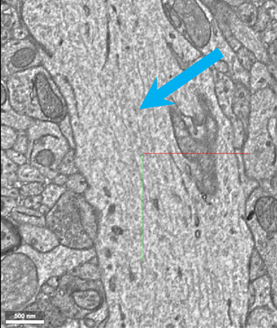{fig-align="center"}

We have pre-selected three examples of microtubules for you in the Annotation layer.    on the `Microtubules` layer:

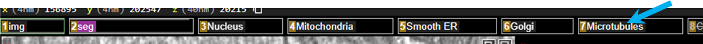{fig-align="center"}

Then  on that same layer tab to activate the microtubules annotations in the Annotations panel.

  on each of the microtubules annotations to center the microtubules in the image viewer. Zoom in and out to get a sense for where this organelle is found. They are most easily located in axons that have been sectioned in transverse.

After you get a sense for what microtubules looks like, it is your turn to find some more. 

[Find three more microtubules in the dataset and annotate them using the annotation point tool and holding  ]{.mark} . It is difficult to measure the size of microtubules, as they are typically ~25nm in diameter, so for this each microtubule, provide the width of the axon that the microtubules are found in the description field for each annotation. 

#### F.	Primary Cilia

Neurons also contain a less well-known organelle called a primary cilia. While the primary cilia was anatomically identified over a century ago, it is only recently that the functional role of this organelle has been defined. Neuronal primary cilia are small, antenna-like organelles that extend from the surface of most neuronal cell bodies. These structures play critical roles in cellular signaling by acting as hubs for the reception and processing of extracellular signals. For example, you might remember that paramecium use cilia to monitor and move around their environment. 

Primary cilia, however, extend forth from the cell body and are not motile (Figure 3). Each neuron has one primary cilia, and this protrusion is different from dendrites and axons, which are processes that we normally associate with extending out from the cell body. While the precise role that primary cilia play in brain function remains to be determined, neuronal primary cilia have been shown to play a role in neuronal signaling (Sheu et al., 2022). Moreover, there are several genetic diseases caused by mutations in primary cilia-specific proteins highlighting the necessity of primary cilia in normal brain function.

Primary cilia are difficult to identify within the raw EM image viewer. They are easier to identify within the segmentation panel by zooming into the cell body and rotating the segmented neuron (see image below, blue arrows).

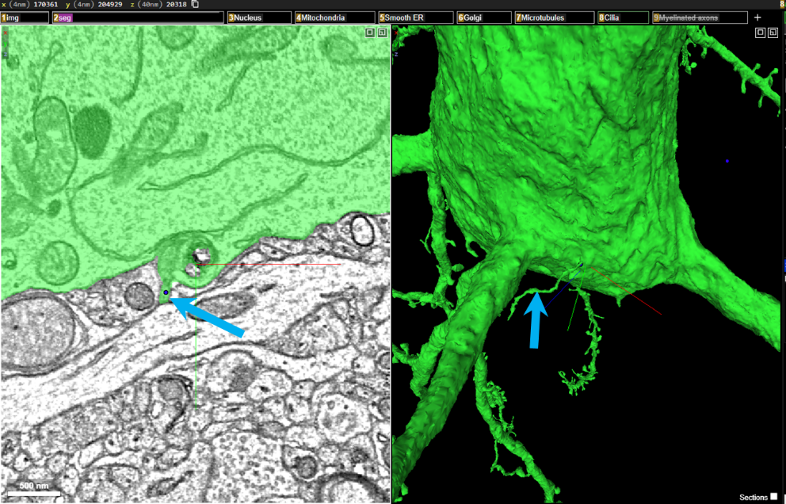{fig-align="center"}

We have pre-selected three examples of primary cilia for you  in the Annotation layer.    on the `Cilia` layer:

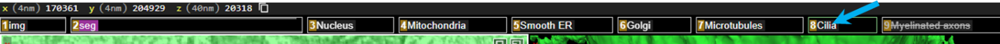{fig-align="center"}

Then  on that same layer tab to activate the cilia annotations in the Annotations panel.

  on each of the cilia annotations to center the microtubules in the image viewer. Zoom in and out to get a sense for where this structure is found. They are most easily located by zooming in and rotating within the segmentation panel.

After you get a sense for what primary cilia looks like, it is your turn to find some more. You will most likely have to find cell bodies in the EM panel,  on them to populate these neurons in the segmentation/3D viewer, and then zoom into these neuronal cell bodies to find the cilia.

It is difficult to measure the length of cilia using the raw EM panel. To activate a scale bar in the 3D/segmentation viewer, toggle the "orthographic" view with  . This will flatten the 3D panel and allow you to better estimate the size of the cilia. Click  again to revert back to the default projection 3D viewer, without the scale bar.

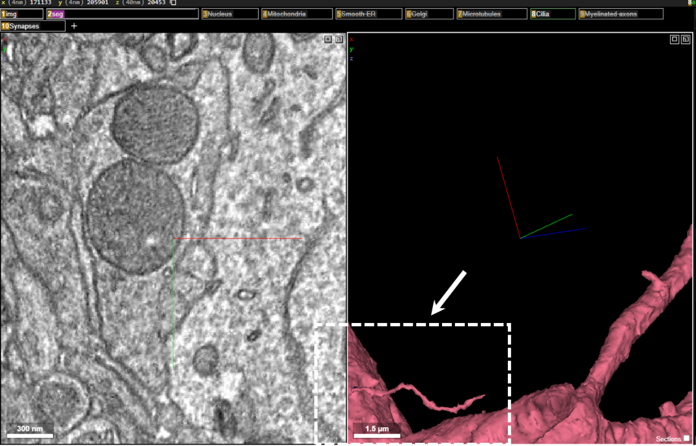{fig-align="center"}

[Find three more primary cilia in the dataset and annotate them using the annotation point tool and holding  ]{.mark} . For each cilia, you should determine the approximate length of the cilia, and place that estimation in the description field for each primary cilia annotation.

#### G.	Myelinated axons

In addition to cytological features inside neurons, we are also able to identify features that characterize neuronal function that lay outside the neuronal membrane. For example, within this dataset you will be able to clearly distinguish the fatty, insulating sheath that wraps some neurons. This fatty substance, called myelin, enables rapid and coordinated communication throughout the brain, and plays an important role in the efficient transmission of electrical impulses down axons (Figure 4). Myelin accelerates the speed of nerve signal conduction, and disruptions in myelin, such as those seen in conditions like multiple sclerosis, can lead to significant neurological impairments.

{fig-align="center"}

The myelin sheath is comprised of membranes of glial processes, and myelin is predominantly found in vertebrate organisms. The myelinating glial cell in the peripheral nervous system (PNS) is called a Schwann cell, and the myelinating glial cell in the central nervous system (CNS) is called an oligodendrocyte. Since the electron microscopic volume we will be exploring is taken from the mouse visual cortex (part of the CNS), we will be visualizing and identifying myelinated axons, where the myelin is from oligodendrocytes. Oligodendrocytes are able to myelinate multiple axons at once, and interestingly not all axons are myelinated, and not all myelinated axons are uniformly myelinated along the length of the axon. There is a growing body of literature that describes how myelination can be altered in the context of learning, and researchers continue to explore how myelination dynamics differ between neurons. 

In electron microscopy, myelin is identified as a dark wrapping around neurons that have been transected (see image below, blue arrows).

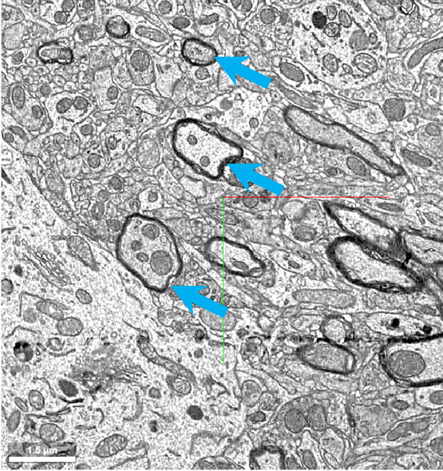{fig-align="center"}

We have pre-selected three examples of myelinated axons for you  in the Annotation layer.    on the `Myelinated axons` layer:

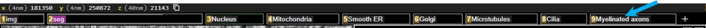{fig-align="center"}

Then  on that same layer tab to activate the Myelinated axon annotations in the Annotations panel.

  on each of the Myelinated axons annotations to center them in the image viewer to get a sense for what they look like. Try zooming in and out of the raw electron microscopic image to get a sense for how the myelinated axons are visualized in this dataset.

[Find three more myelinated axons in the dataset and annotate them using the annotation point tool and holding  ]{.mark} . For each axon, determine the approximate diameter of the axon (including the myelin sheath), and place that estimation in the description field for each annotation.

#### H.	Synapses

Now that we have explored the organelles and features of neurons, let’s focus on the ultrastructure of the primary site of communication between neurons and other brain cells: the synapse.  In Figure 5, we can see the contents of the pre- and postsynaptic sides of chemical and electrical synapses. We can see organelles such as mitochondria, which provide energy for neurotransmitter release, and synaptic vesicles, which are membrane-bound packets that contain neurotransmitter molecules. We can also see structures like the synaptic cleft that separates the sides of a chemical synapse, and the tight junctions between the sides of an electrical synapse.

![Figure 4. Electron micrographs of chemical (A) and electrical (B) synapses. Mitochondria are indicated by asterisks. In the left panel, the pink arrow indicates a synaptic vesicle. In the right panel, the pink arrows indicate a cell-cell junction between neurons. Source: [@Luo2016principles] ](resources/luo_synapses.png)

In electron microscopy, synapses are identified by the presence of synaptic vesicles and pre- and postsynaptic densities (see image below where the blue arrows are pointing to presynaptic vesicles and the yellow arrowheads are pointing to the postsynaptic densities. The synaptic cleft (the space between the pre- and postsynaptic neurons can sometimes be difficult to visualize. 

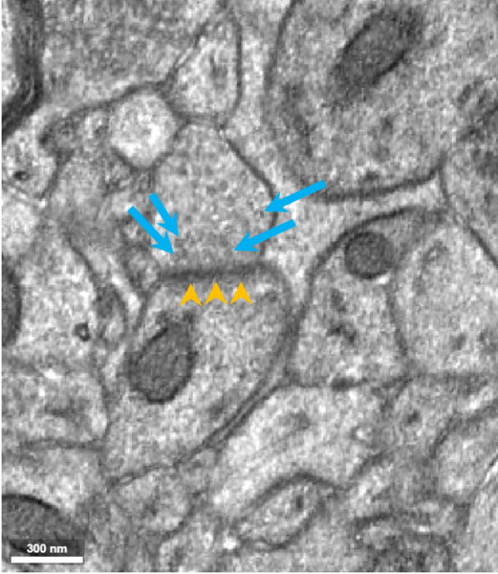{fig-align="center"}

When identifying synapses, it can be helpful to pay attention to the 3D segmentation panel, as synapses are also often identified by presynaptic “bulges” in the axon terminals, and postsynaptic spine “heads” on the dendrites (see image below):

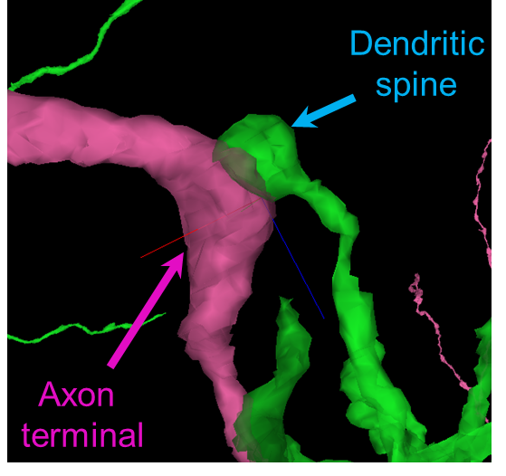{fig-align="center"}

We have pre-selected three examples of synapses for you in the Annotation layer.   on the `Synapses` layer:

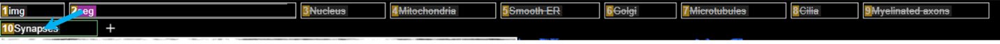{fig-align="center"}

Then  on that same layer tab to activate the Synapse annotations in the Annotations panel.

  on each of the Synapse annotations to center them in the image viewer to get a sense for what they look like. Try zooming in and out of the raw electron microscopic image to get a sense for how the synapses are visualized in this dataset. 

Then } on the raw electron microscopic image to activate the pre and postsynaptic neurons in the volumetric 3D panel. Synapse-1 is shown below:

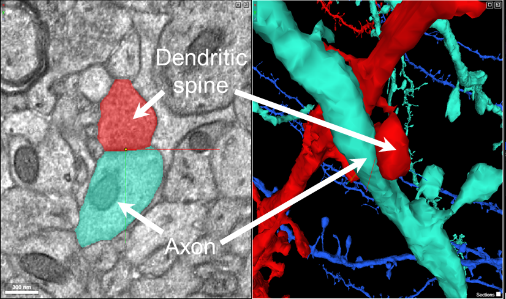{fig-align="center"}

Rotate the 3D panel to get a sense for what a synapse looks like in 3D.

[Find three more synapses in the dataset and annotate them using the annotation point tool and holding  ]{.mark} . For each synapse determine the approximate width of the pre- and post-synaptic contact, and place that estimation in the description field for each annotation. 

#### I.	Interesting structures

Now, it is your turn to find some interesting structures within the dataset. Explore the raw EM images and identify three structures that seem interesting to you. Center the structure within your viewer. 

[Find three interesting structures in the dataset and annotate them using the annotation point tool and holding   (within the synapse layer panel) ]{.mark} . For each interesting structure, add “interesting structure to the description field for each annotation.

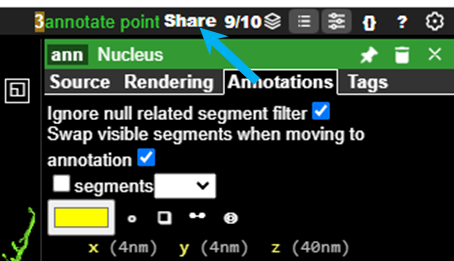{fig-align="center"}

[When you have completed the search for interesting structures, click “Share” to generate a link]{.mark} that will include all of the annotations, for all the organelles that you found, and will allow your instructor to view each annotation.

Paste that link here:

URL: 

 
 

## Additional Resources

You can explore the MICrONS dataset further at:
[MICrONS-Explorer.org](https://www.microns-explorer.org/cortical-mm3)

## Works Cited

