  

::: {.content-visible when-format="html"}
[{fig-align="center"}](https://spelunker.cave-explorer.org/#!middleauth+https://global.daf-apis.com/nglstate/api/v1/5669296259727360)
:::

## Overview

This laboratory module introduces students to the structure-function relationship of dendritic spines using large-scale volumetric electron microscopy (EM) data. Students will use Neuroglancer to explore the MICrONS EM dataset, allowing them to identify and classify dendritic spines, in addition to examining how dendritic spine morphology varies across synapses. Through guided analysis, this module emphasizes how differences in spine shape, size, and connectivity relate to synaptic strength and circuit connectivity, providing hands-on experience with modern connectomics tools and quantitative neuroanatomy. 

## Learning Goals

 After completing this module, you will be able to:
 
* Engage with Neuroglancer and associated electron microscopy layers/panels to identify neurons, dendrites, and individual dendritic spines.
* Identify and describe the major classes of dendritic spine morphologies.
* Locate excitatory synapses in EM data and distinguish between pre- and post-synaptic elements based on ultrastructural features.
* Interpret how spine morphology reflects differences in synaptic connectivity.
* Explore the principles of inhibition and synaptic integration using defined synaptic inputs.

## Background and Introduction

### Axons and Dendrites

Neurons are polarized cells in the brain that contain specialized processes that extend out from a cell body/soma (Figure 1). The two major neuronal processes, axons and dendrites, support information flow within neuronal circuits. Dendrites typically receive and integrate synaptic inputs, while axons transmit signals away from the neuron and form synapses onto target cells. In electron microscopy datasets, dendrites can often be distinguished from axons by the presence of spines, which are small protrusions extending from dendrites that serve as primary postsynaptic sites of excitatory synaptic transmission.

![Figure 1. Schematic representation of the cell body, dendrites, and axon of a neuron. Source: [@Luo2016principles] ](resources/luo_neuron_schematic.png) 

### Dendritic Spines

Dendritic spines are small protrusions that extend from neuronal dendrites and serve as specialized compartments for synaptic connectivity. They are most commonly associated with excitatory synapses, though not all excitatory synapses occur on spines, and not all synapses formed onto spines are excitatory. Dendritic spines exhibit substantial diversity in size and morphology, and are typically classified based on shape into mushroom, thin, stubby, or filopodial types (Figure 2). In this lab, you will examine how dendritic spines are classified based on their morphology and gain insight into how these structures contribute to synaptic function and plasticity. 

![Figure 2. Cartoon depictions of four distinct morphological types of dendritic spines. Source: Adapted from [@Pchitskaya_2020].](resources/synapse_shapes_pchitskaya.jpeg)

## Laboratory Module

### Navigating Neuroglancer panels

We will be working within the Neuroglancer browser to identify ultrastructural features within the electron micrographic dataset. You can access Neuroglancer by clicking on this link or by copying and pasting the following text into your browser:

> <https://spelunker.cave-explorer.org/#!middleauth+https://global.daf-apis.com/nglstate/api/v1/6722224001122304>

:::{.callout-tip}
You may be prompted to provide a Google login. Please login with your e-mail address.
:::

Once logged in, you should see the following screen:

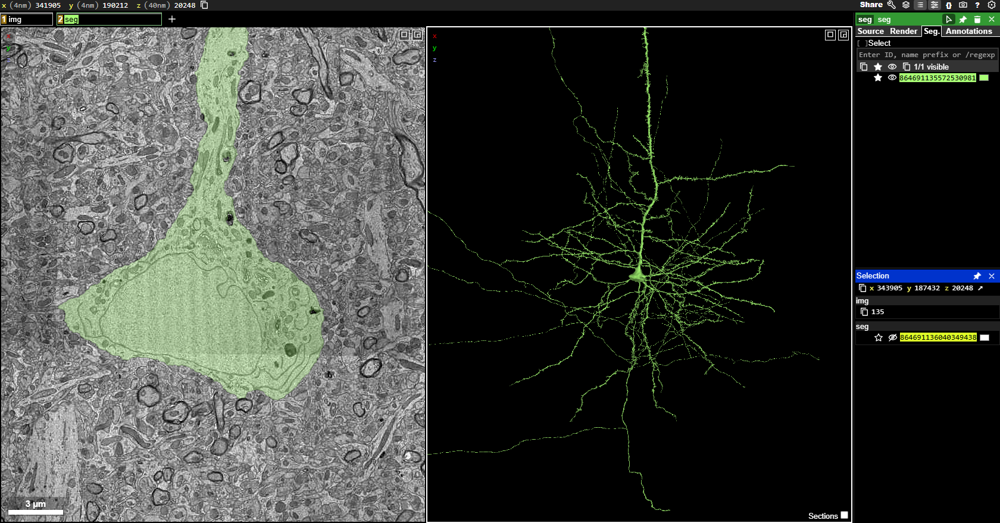{fig-align="center"}

:::{.callout-caution}
## If segmentation does not render

If the segmentation does not render, follow these steps:

1)	Go here: <https://global.daf-apis.com/sticky_auth/api/v1/tos/2/accept> to accept terms of service on your google authorized account
2)	Hard refresh your neuroglancer window. 
3)  If the righthand menu segmentation window still shows a red error message, call your instructor/TA
:::

To orient yourself, the left-most panel displays the electron micrographic (EM) images. This is the raw data generated from the cutting, sectioning, staining, and imaging of the one micrometer cubed chunk of mouse visual cortex that serves as the basis of this dataset. Note: In the left-most panel, you are looking at a cross-section of the soma and the apical dendrite extending forth from the top of the soma (shaded in green). The middle panel displays the 3D segmentation of the neuron that is clicked on within the raw EM images, and this view shows the morphology of that green neuron reconstructed in its entirety. 

The neuron you are looking at is a pyramidal neuron within visual cortex. Notice that this cell has many processes extending forth from the soma. 

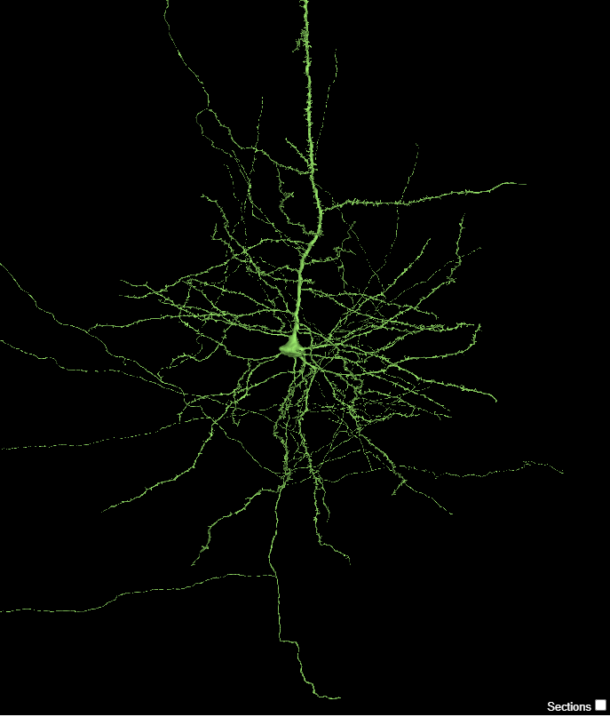{fig-align="center"}

You can engage with the neuron in the middle viewing panel by using the following commands:

* Jump to a location with 
* You can rotate the 3D view by  and dragging the mouse pointer 
* You can slide (pan) the 3D view by  and dragging your mouse pointer
* You can zoom into the neuron by holding  and using the  (or by holding  and pressing  or , if using a keyboard)

Take a moment to play around with these controls to familiarize yourself with how to interface with the viewing panel and rotate the neuron within it.

:::{.callout-caution}
The controls have slightly different functions in 2D or 3D. If you  in 3D, you 'pan' the view left and right. If you  in 2D you rotate the section view. 

Because this data is *anisotropic*, it has a different 'thickness' when turned on its side than when face on. Generally, you do not want your 2D plane to rotate. If you do accidentally, you can reset to coordinate axes by hovering your mouse over the 2D pane and hitting 
:::

### Dendritic spine morphology

The neuron you are looking at contains structures called dendritic spines which are somewhat difficult to distinguish when your view is zoomed out. When you zoom in, you should be able to see small protrusions extending from the dendrites. Zoom into the 3D viewer  and identify these spines. To remind you, there are four morphological types of spines, classified as follows:

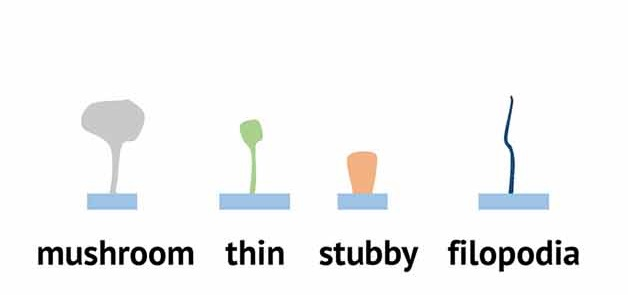{fig-align="center"}

:::{.task}
Zoom into the 3D viewer panel and take a zoomed-in screen shot of dendritic spines that closely resemble each of the four types of spines (mushroom, thin, stubby, and filopodia).
:::

:::{.task}
With your lab partner, consider how easy or hard it was to determine what type of spine you were looking at. Was it ambiguous or clear? How did you ultimately come up with your classification? What morphological aspects helped you decide which type of spine you were looking at?
:::

### Axons vs Dendrites

Upon close inspection of this neuron, you can observe that not every process extending from the soma contains spines. This is because only dendrites have spines – axons do not. Below (right) is a pseudocolored representation of this pyramidal neuron where the dendrites are colored red, and the axons are colored blue. If you zoom in on the location highlighted with the dashed circle, you can see something that looks like this

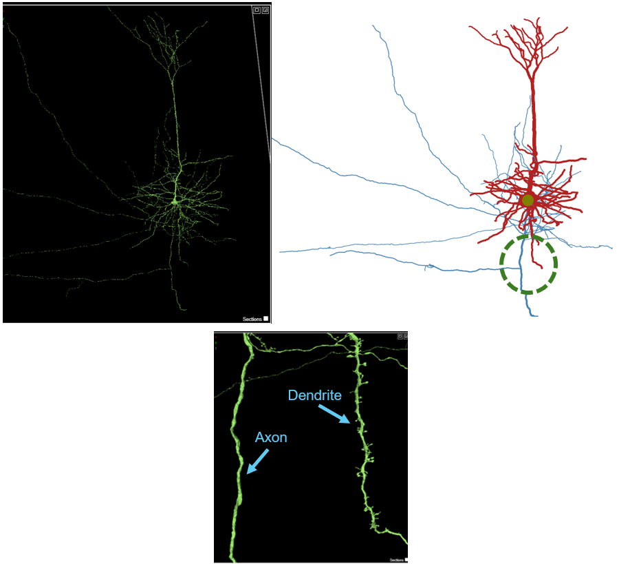{fig-align="center"}

:::{.task}
Think about the function of the axon and the dendrite and speculate why axons do not have spines, while dendrites do. What aspects of the structure and function of axons, compared to dendrites, do you think is important to consider?
:::

### Spine vs. Shaft vs. Somatic synapses

This pyramidal neuron receives synaptic input from many other neurons. At any given moment, the membrane potential of the neuron is fluctuating based upon the active synaptic input onto it, and all of these inputs are integrated at the axon hillock, directly adjacent to the soma (a process known as synaptic integration). Synapses that influence neuronal firing typically occur at three major compartments of the neuron: dendritic spine, dendritic shaft, or the soma (Figure 3). Dendritic spines are electrically and biochemically compartmentalized, and are almost always excitatory. Dendritic shaft synapses can modulate dendritic integration over broader spatial domains, and can be excitatory or inhibitory. Somatic synapses (directly onto the soma) exert powerful control over neuronal output by directly regulating action potential initiation, as these synapses are closest to the axon hillock. These somatic synapses are often inhibitory. 

![Figure 3. Schematic depiction of a spine (left) and shaft (right) synapse onto a dendrite. Adapted from [@Bucher_2019] ](resources/spine_shaft_bucher.png){fig-align="center"}

Let’s take a look at these synaptic arrangements on our pyramidal neuron. 

Left click on the layer heading that is stricken through:

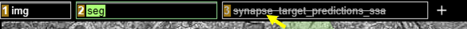{fig-align="center"}

You can activate the postsynaptic target prediction layer which will overlay numerous dots onto the neuron. These dots are sites of synaptic inputs onto the pyramidal neuron, where our pyramidal neuron is the postsynaptic neuron. Spine synapses are colored purple, shaft synapses are yellow, and somatic synapses are in cyan. This may take a minute to load, and should look like this:

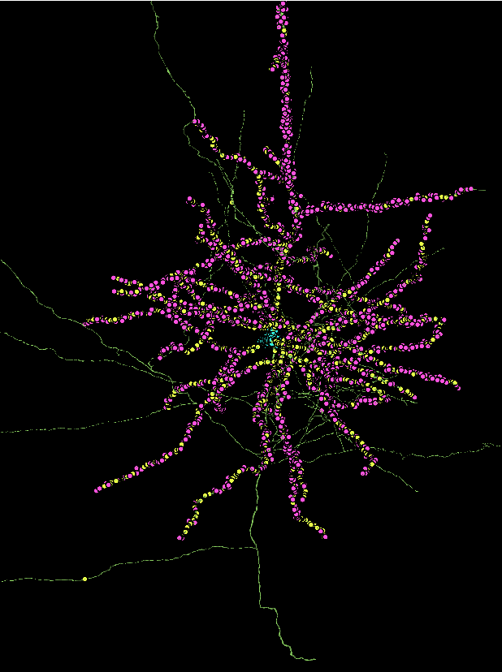{fig-align="center"}

Every single one of these synapses has the capacity to influence the likelihood that this one pyramidal neuron will fire an action potential. All inputs onto this neuron are integrated, and the point where it is “decided” whether or not to fire an action potential is at the axon hillock.

:::{.task}
Zoom into the 3D panel and locate the axon hillock of this neuron. Remember, both dendrites and axons extend forth from the soma, but the axon will not have any spines. Zoom into the neuron and center the axon hillock within your panel. Take a screen shot of this view that highlights the axon hillock.
:::

:::{.task}
Consider four hypothetical synaptic sites below:
:::

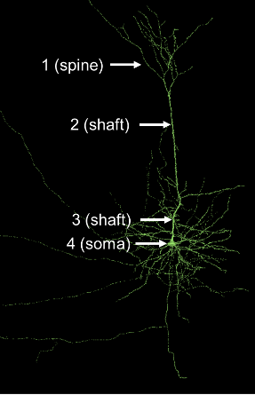{fig-align="center"}
 
5a. Assume both shaft synapses (2 and 3) are inhibitory. Would both of these synapses inhibit the neuron equally or would one synapse more strongly inhibit the pyramidal neuron from firing an action potential? Explain your answer. 

 
 
 
 

5b. Which synapse (1, 2, 3, or 4) is closest to the axon hillock?

 
 

### Excitatory vs. Inhibitory synapses

As previously mentioned, neuronal synapses can be broadly classified as excitatory or inhibitory. Excitatory synapses increase the likelihood that a postsynaptic neuron will fire an action potential, typically by allowing positive ions (e.g. Na+ or Ca2+) to enter the cell. Inhibitory synapses decrease the likelihood of firing an action potential, typically by allowing negative ions (e.g. Cl-) to enter the cell or by allowing positive ions (e.g. K+) to leave the cell. Whether or not a synapse is excitatory or inhibitory depends on the neurotransmitter released from the presynaptic neuron and the neurotransmitter receptor that is present on the postsynaptic target. Generally speaking, in vertebrates, glutamate is the most common excitatory neurotransmitter while GABA or glycine are the most common inhibitory neurotransmitters. The balance between excitatory and inhibitory inputs is critical in shaping neural circuit activity, information processing, and behavior.

Pyramidal neurons, like the one you are looking at, are typically excitatory neurons that release glutamate when excited. You have been focusing on the synaptic inputs to this neuron, but to place this cell into its brain circuit, we should explore this neuron’s postsynaptic targets – the neurons onto which this pyramidal neuron will secrete neurotransmitters. These synapses are mostly found towards the end of the axon, at the axon terminals, and you should notice that this neuron has many axon collaterals (branches) that are not often depicted in textbooks. However, this is how neurons typically look. 

To visualize the output synapses that this pyramidal neuron makes, where the green neuron is the presynaptic partner, you can deselect the synapses, where it is postsynaptic (the ones you have been visualizing), and select the synapses that this neuron sends out. Right click on the `synapse_target_predictions_ssa` layer and then deselect the "post" box and select the "pre" box in the panel on the right (again, this will take ~1 minute to load)

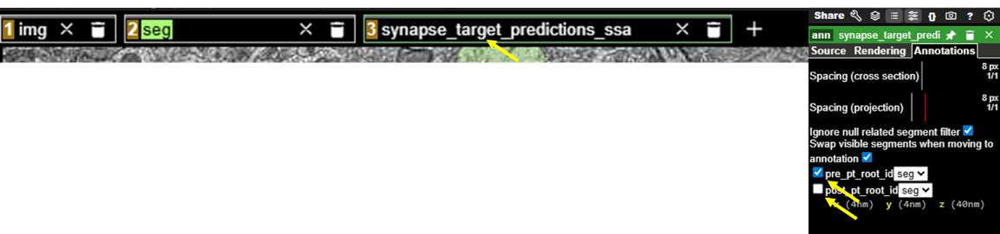{fig-align="right"}

You should now see something like this:

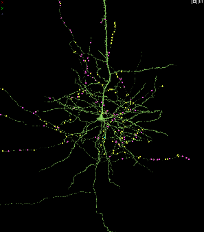{fig-align="center"}

Zoom into and navigate within the 3D panel and notice that most of the colored dots are now on the axon and axon terminals. These are synapses where this pyramidal neuron is presynaptic to its synaptic partner.

:::{.task}
This pyramidal neuron is excitatory. What neurotransmitter does this neuron most likely secrete from these presynaptic terminals?
:::

Now, let’s explore the postsynaptic targets of this pyramidal neuron. To do this, zoom into the 3D viewer panel onto one of the synaptic dot markers. Right clicking in the 3D panel will bring you right to the point where you click, which can help navigate towards a synapse. Each dot contains a line that connects it to its synaptic partner, which you can find by scrolling and clicking in the actual EM image on the left. Here is one of the synapses of the pyramidal neuron:

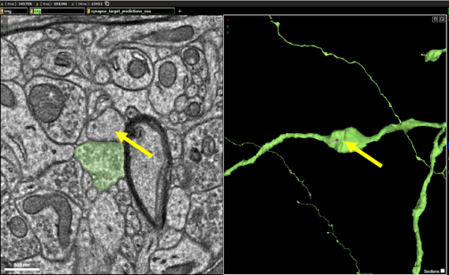{fig-align="center"}

If you double click on the synaptic partner, you can activate that neuron and see the shape of the postsynaptic structure, like this:

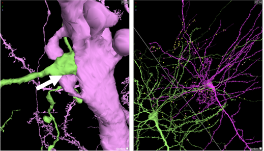{fig-align="center"}

The purple neuron is the postsynaptic neuron, and you can see that our pyramidal neuron synapses on its postsynaptic partner at a dendritic spine (arrow, left above), and a more zoomed out perspective of the two neurons is to the right. Close observation of the dendritic spine shows that it is a mushroom-shaped dendritic spine. 

:::{.task}
Now, it is your turn to explore the postsynaptic partners of the pyramidal neuron. Locate and investigate 5 synapses that this pyramidal neuron makes (where the pyramidal neuron is the presynaptic partner). Activate its postsynaptic partner by double-clicking on the EM image of its synaptic partner. Investigate this synapse – you may have to click on and off both neurons using the EM panel to get a good understanding of the postsynaptic structure. After analyzing it, determine if the postsynaptic structure is a soma, shaft, or spine. And if it is a spine, what morphological type is it (mushroom, thin, stubby, or filopodial)? Make sure that for each synapse the postsynaptic structure is visible, and place your answers into the table below. Use the “Share” feature to copy the URL of your Neuroglancer state and paste the shared URL in the table below:
:::

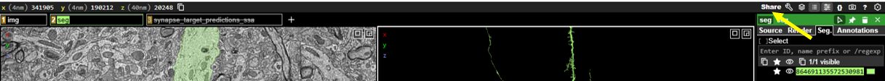{fig-align="center"}

|      |                       |                     |                 |  
| -----| --------------------- | ------------------- | --------------- | 
| **Synapse**    | **Postsynaptic structure (spine, shaft, or soma)**      | **Spine type (if spine)** | **Shared URL** | 
| 1 |                       |                     |                 |  
| 2 |                       |                     |                 |  
| 3 |                       |                     |                 |  
| 4 |                       |                     |                 |  
| 5 |                       |                     |                 | 

: {.bordered tbl-colwidths="[8,32,25,35]"}

 
 

### Shunting inhibition

So far, we have primarily focused on the output of an excitatory pyramidal neuron. However, whether or not this neuron becomes active depends on the inputs it receives from its own presynaptic partners. In many cases, excitatory neurons are also targeted by inhibitory synapses which act as a brake on neuronal excitability. These inhibitory inputs are often located on or near the soma, positioning them to exert strong control over spike generation. 

To explore this connectivity, let’s visualize the presynaptic neurons onto our pyramidal neuron by clicking this link: (Note: this curated link contains fewer synapses than the previous link to simplify exploration). 

> <https://spelunker.cave-explorer.org/#!middleauth+https://global.daf-apis.com/nglstate/api/v1/6362457307086848>

Zoom into the soma of the neuron in the 3D viewer, and you can see the cyan (somatic) synapses. 

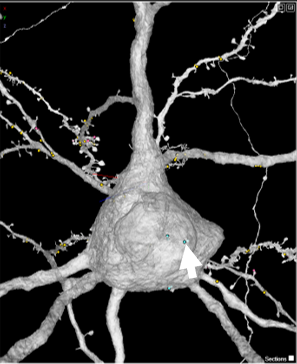{fig-align="center"}

Right click the cyan dot to center the synapse in both the 3D viewer and the EM image to the left. Then, in the EM viewer on the left, double click to activate the presynaptic neuron that is forming a synapse onto the soma. Double click directly on the EM image at the location of the cyan dot, and a second neuron should appear the 3D viewer. 

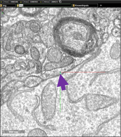{fig-align="center"}

:::{.task}
Zoom out in the 3D viewer so that you can compare these two neurons. How does this new presynaptic neuron (in color) compare to the pyramidal neuron (gray) we have been looking at? Does the presynaptic neuron contain any similar or different properties? Does it have spines?
:::

A major goal of the connectomics effort to map the mouse brain is to identify the diverse cell types that compose neural circuits and to understand how their connectivity supports brain function. We can learn more about this presynaptic neuron, and all of the other neurons in the dataset, by using accessory software tools developed by MICrONS researchers, known as Dash Apps. 
Navigate to this [Dash App: Table Viewer](https://tutorial.microns-explorer.org/dash-table-viewer.html) and then click on the Table Viewer link:

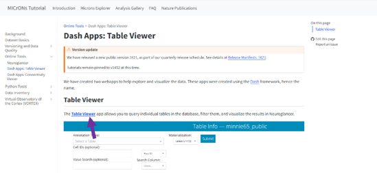{fig-align="center"}

You will need to log in to access the Table Viewer.

Now, let’s find out the identity of the presynaptic neuron that synapses onto the soma of our pyramidal neuron. 

Copy the segment ID of this neuron by clicking on this button here: 

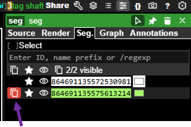{fig-align="right"}

And, then go back to the Dash Apps Table Viewer and select `aibs_metamodel_celltypes_v661` to access the cell type table: 

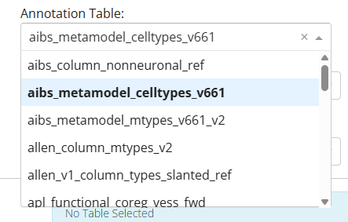{fig-align="center"}

And, then paste the neuron ID you copied into the Cell ID field, and click “Submit”

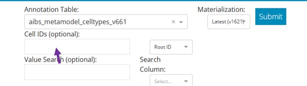{fig-align="center"}

You should see something like this

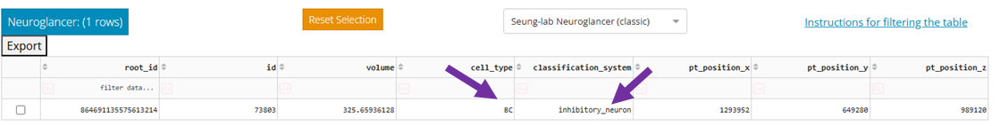{fig-align="center"}

Notice the two middle columns labelled `cell_type` and `classification`. From these fields, you can see that this neuron is an inhibitory neuron of the BC cell type. BC stands for **basket cell**, a GABAergic inhibitory neuron commonly found in the cerebral cortex. Also note that this basket cell forms two somatic synapses close together on the pyramidal neuron’s soma, a configuration that likely provides especially strong inhibitory control over the neuron’s excitability. 

:::{.task}
Now, it’s your turn to explore the presynaptic partners onto this pyramidal neuron. Using the cyan, yellow, or pink dots as your guide, right click on the presynaptic partner for synapses on:
:::

1. soma
2. proximal dendritic shaft (a dendritic shaft close to the soma)
3. distal dendritic shaft (a dendritic shaft far from the soma)
4. spine

Copy the segment ID of each presynaptic neuron and paste that ID into the Table viewer to obtain cell type and classification information below. Fill in the table below with your findings.

|      |                       |                     |                 |                  |  
| -----| --------------------- | ------------------- | --------------- | --------------- | 
| **Synapse**    | **Color of marker (red, yellow, cyan)**      | **Postsynaptic structure (Soma, proximal dendritic shaft, distal dendritic shaft, spine)** | **Presynaptic neuron classification (Excitatory or inhibitory)** | **Cell Type** |
| 1 |                       |                     |                 |                   |  
| 2 |                       |                     |                 |                   |  
| 3 |                       |                     |                 |                   |  
| 4 |                       |                     |                 |                   |  

: {.bordered tbl-colwidths="[8,20,32,25,15]"}

 
 

:::{.task}
Examine the identities of the presynaptic neurons and where they form synapses on the pyramidal neuron. Do you notice any relationship between neuron type and synapse location? Which inputs are excitatory and which are inhibitory? Based on their location, which neurons are likely to have the greatest influence on whether the pyramidal neuron fires an action potential?
:::

## Additional Resources

You can explore the MICrONS dataset further at:
[MICrONS-Explorer.org](https://www.microns-explorer.org/cortical-mm3)

## Works Cited
