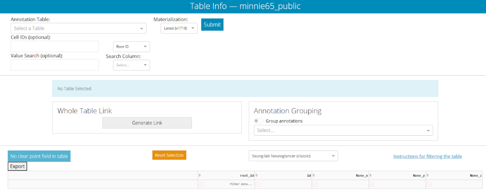
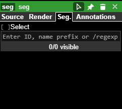
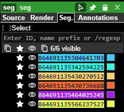
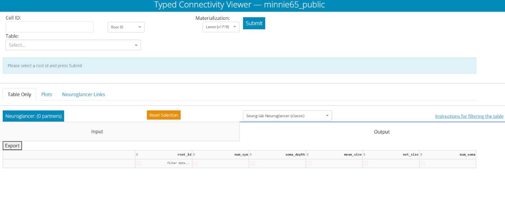
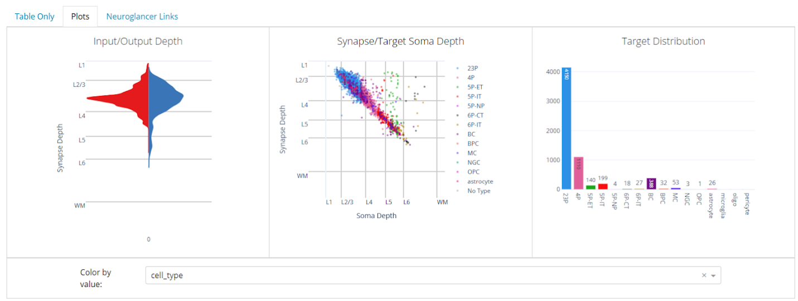

  

::: {.content-visible when-format="html"}
[{fig-align="center"}](https://spelunker.cave-explorer.org/#!middleauth+https://global.daf-apis.com/nglstate/api/v1/5853606858194944)
:::

## Overview

This lab module provides an introduction to the different types of neurons that populate the cortex and the patterns of connectivity between them. Students will explore neurons of different types using the Neuroglancer browser and Dash Apps that allow all the neurons in the MICrONS dataset to be queried based on their type, classification, and other metadata. Particular focus will be on the connectivity patterns of major inhibitory interneuron types, such as Basket Cells and Chandelier Cells.

## Learning Goals

 After completing this module, you will be able to:
 
* Use Dash Apps associated with the MICrONS dataset to navigate and search lists of neurons based on their cell type, connectivity, and other properties.
* Identify and discuss the properties of different types of neurons that populate the mouse visual cortex.
* Explore patterns of synaptic connectivity between different types of cortical neurons.
* Consider the features that are commonly used to subdivide neurons into different types.

## Background and Introduction

### Neuron Types

The vertebrate brain contains dozens of types of neurons that can be classified based on their neurotransmitter type, morphology, location, and connectivity. These features often directly impact the roles of specific neurons in nervous system function. Pyramidal cells are the primary excitatory output neurons of visual cortex and may be identified based on their use of glutamate as a neurotransmitter, pyramidal morphology, spiny dendrites, and long-range axonal projections. These cells may be further subdivided based on their location within cortical layers and specific patterns of connectivity.

The visual cortex contains numerous types of inhibitory interneurons that all share the same neurotransmitter (GABA), but may differ radically in terms of morphology, connectivity, and circuit function (Figure 1). In this module, we will focus our attention specifically on Basket Cells (BC) and Chandelier Cells (ChC), which make inhibitory synapses onto the cell bodies and axon initial segments of target cells. This allows them to strongly influence action potential firing in their target neurons.

![Figure 1. Inhibitory neuron types of mouse primary visual cortex. Basket and Chandelier cells are indicated by dashed outlines. Adapted from [@Jiang_2015] ](resources/basket_and_chandelier_jiang.png)

Basket Cells and Chandelier Cells are interesting examples of cells that might look very similar to the casual observer. Both are inhibitory interneurons that inhibit pyramidal cells and that have highly branched axon and dendrite arbors surrounding their cell body. However, a closer analysis of these neurons reveals interesting differences between the two types. For example, they differ in their synaptic targeting of Pyramidal Cells – Basket Cells make many inhibitory synapses on the cell bodies of Pyramidal Cells, while Chandelier Cells general target axon initial segments. It is also the case that the dendritic and axonal arbors of Basket Cells often overlap in space, while the arbors of Chandelier Cells are spatially distinct (Figure 2). This is one example of how subtle similarities and differences between neuron types can make cell classification a challenging problem

![Figure 2. Morphological and synaptic targeting of Basket and Chandelier Cells. Adapted from [@Fino_2013]](resources/basket_and_chandelier_fino.png)

### Classification of Neurons in Visual Cortex

Massive connectomics datasets, such as the MICrONS dataset, provide huge amounts of information with which to classify and analyze neuron types. In a recent study, researchers were able to classify multiple cell types of visual cortex by analyzing their nuclei and perisomatic regions (i.e. the areas around the cell body) [@elabbady_perisomatic_2025] (Figure 3). Using this approach, researchers were able to predict the cell type of all of the cells in the dataset with a high level of accuracy and reliability.

![Figure 3. Nuclei and perisomatic features used in the classification of cell types in the MICrONS dataset [@elabbady_perisomatic_2025]](resources/perisomatic_features_elabbady.png)

### Dash Apps

The entire MICrONS dataset can be queried through the use of Dash Apps, which allow scientists to search for neurons based on their location, type, and connectivity. These tools allow for larger scale analysis of the dataset and generation of hypotheses related to neuronal cell types and their connectivity.

## Laboratory Module

### Table Viewer Dash App

For this lab we will be working with Dash Apps associated with the MICrONS dataset. The Dash Apps allow the database of cells and synapses to be searched and sorted based on attributes such as their predicted cell type, position, and synaptic connections. We will look at two Dash Apps today. One is called the Table Viewer, which allows us to generate a sortable list of cells based on specific features. The other is called the Connectivity Viewer, which will generate a list of cells based on their synaptic connectivity.

We will use the Table Viewer first. You can access it by clicking the following link: [Table Viewer](https://minnie.microns-daf.com/dash/datastack/minnie65_public/apps/table_viewer/?datastack=%22minnie65_public%22)

You can also cut and paste the following URL into your browser:

> <https://minnie.microns-daf.com/dash/datastack/minnie65_public/apps/table_viewer/?datastack=%22minnie65_public%22>

:::{.callout-tip}
You may be prompted to provide a Google login. You may use any Google account.
:::

Once logged in, you should see the following screen:

The panel at the top left will allow us to choose the table of cells that we wish to generate. 

* **Annotation Table** selection box allows us to choose the attributes we want to see in our table.  
* **Materialization** selection box allows us to choose a specific version of the dataset - this is particularly important for a dataset that is being rapidly updated. 
* **Cell IDs** box allows us to search for specific neurons. 
* **Value Search** box allows us to search for specific data points that have been attached to the neuron.

For now, please select `aibs_metamodel_celltypes_v661` in the Annotation Table selection box and then click the "Submit" button. After the app processes this request (<1 minute), it will return a giant table of cell Root IDs and the predicted cell type for each. 

Predicted cell types are listed in the “cell_type” column, while the broader classification of the cell is listed in the “classification_system” column. You can left-click on the heading of any of these columns to sort the table based on the data in that column. All of the cell types in this table were predicted using a machine-learning algorithm that analyzed features of the cell body in electron microscopy data [@elabbady_perisomatic_2025] .

## Cell Type Exploration

Now we can pull some cells out of the table that we created in the previous section and see what they look like in Neuroglancer. In a separate browser tab or window, you can navigate to the following link: [Neuroglancer](https://spelunker.cave-explorer.org/#!middleauth+https://global.daf-apis.com/nglstate/api/v1/6448634630504448)

You can also cut and paste the following URL into your browser:

> <https://spelunker.cave-explorer.org/#!middleauth+https://global.daf-apis.com/nglstate/api/v1/6448634630504448>

:::{.callout-tip}
You may be prompted to provide a Google login. You may use any Google account.
:::

You should now see a familiar Neuroglancer window. In the right panel, you will see a space where you can paste a Root ID.

You can now navigate back to your previous Table Viewer tab or window. In the table you can left-click on a Root ID box to highlight it and then right-click on it to Copy the Root ID (Note: You can also use CTRL-C to do this). You can then bring that copied Root ID back to the Neuroglancer window and paste it into the “Enter ID…” space. This will populate the segments list with your Root ID. You can click the eye icon next to the Root ID to make it visible in the viewer. If you have entered the Root ID for a neuron, you can also left-click the “synapse_target_predictions” tab above the EM window to add dots wherever the selected neuron is making a presynaptic terminal.

{fig-align="right"}

:::{.task}
Please find five Root IDs in the Table Viewer, each representing a different cell type. One at a time, enter each into the Neuroglancer browser and observe the morphology and synapse distribution of the cell. (You may find some Root IDs for which a morphology mesh and/or synapses do not appear in the browser. If this happens, please switch to a different Root ID. The cause of this is constant updates to the dataset that sometimes lead to the browser and database being unsynchronized.)
:::

Is the cell highly branched or relatively unbranched? Is it large or small? Does it have dendritic spines? Does it make many synapses or just a handful? Are those synapses nearby to the cell body or distant?

For each of your five cells, enter the Root ID, Cell Type, and notes into the following table.

|                          |                     |                 |
| -------------------------| ------------------- | --------------- | 
| **Root ID**    | **Cell Type**      | **Notes (e.g. morphology, size, synapse distribution) ** | 
|                          |                     |                 |
|                          |                     |                 | 
|                          |                     |                 | 
|                          |                     |                 |
|                          |                     |                 |

: {.bordered tbl-colwidths="[36,18,46]"}

 
 

Also take a screenshot of each of the five cells you selected and include them in this submission.

For your reference, these are some of the cell types that you may encounter in the table viewer:

* **Pyramidal cells:** These are the major excitatory neurons of the cortex. They are always indicated by the cortical layer that they occur in and the letter “P” (e.g. 23P, 4P, 5P-IT).
* **Inhibitory interneurons:** These are given abbreviated names in the table. You will see Basket Cells (BC), Bipolar Cells (BPC), Martinotti Cells (MC), and Neurogliaform Cells (NGC).
* **Non-neural cells:** You may see astrocytes (neural support cells), microglia (brain immune cells), and oligodendrocytes (myelinating cells).

### More Cell Type Exploration

All of the cell-type classifications that we have worked with thus far have been based on computer algorithm predictions that used perisomatic features (the electron microscope data in and around the cell body) as their starting point. Thus, it is interesting to consider that these predictions do not use the typical data that researchers have used to classify neurons for decades (e.g. morphology, gene expression, electrophysiological data). With this in mind, it would be interesting to see how well the algorithm performed by comparing some neurons that it classified into the same category.

#### Cortico-cortical

First, we will look at some cortico-cortical pyramidal cells. These are excitatory neurons that project to other cortical regions. The following link will take you to a Neuroglancer window containing a selection of Layer 2 Pyramidal Cells: [Layer 2 Pyramidal Cells](https://spelunker.cave-explorer.org/#!middleauth+https://global.daf-apis.com/nglstate/api/v1/5037233433214976)

You can also cut and paste the following URL into your browser:

> <https://spelunker.cave-explorer.org/#!middleauth+https://global.daf-apis.com/nglstate/api/v1/5037233433214976>

Take some time to explore these neurons in the 3D viewer. You might consider making one or more of the neurons invisible using the “eye” icons at the top right. This will help you make comparisons between just a couple of neurons at a time.

{fig-align="right"}

:::{.task}
How do the neurons compare to one another in terms of morphology and position? Consider the positions of their cell bodies, the morphology of their dendritic field (spiny processes), and the branching pattern of their axons (aspiny processes). Which aspects are similar between all six neurons? Which aspects are more variable?
:::

#### Corticothalamic

Next, we will look at some Layer 6 corticothalamic pyramidal cells. These are excitatory neurons that project from the visual cortex back to the thalamus to provide feedback within the visual system. The following link will take you to a Neuroglancer window containing a selection of Layer 6 Pyramidal Cells: [Layer 6 Pyramidal Cells](https://spelunker.cave-explorer.org/#!middleauth+https://global.daf-apis.com/nglstate/api/v1/6604773955469312)

You can also cut and paste the following URL into your browser:

> <https://spelunker.cave-explorer.org/#!middleauth+https://global.daf-apis.com/nglstate/api/v1/6604773955469312>

As you did before, take some time to explore these neurons in the 3D viewer. You might consider making one or more of the neurons invisible using the “eye” icons at the top right. This will help you make comparisons between just a couple of neurons at a time.

:::{.task}
How do the neurons compare to one another in terms of morphology and position? Consider the positions of their cell bodies, the morphology of their dendritic field (spiny processes), and the branching pattern of their axons (aspiny processes). Which aspects are similar between all six neurons? Which aspects are more variable?
:::

#### Inhibitory interneurons

Finally, we will look at some inhibitory cell populations in the dataset. The following Neuroglancer link displays Basket Cells and Chandelier Cells, two of the well-described inhibitory interneuron cell types. These cells release GABA to inhibit the activity of their synaptic targets. [Basket and Chandelier Cells](https://spelunker.cave-explorer.org/#!middleauth+https://global.daf-apis.com/nglstate/api/v1/5220264739602432)

You can also cut and paste the following URL into your browser:

> <https://spelunker.cave-explorer.org/#!middleauth+https://global.daf-apis.com/nglstate/api/v1/5220264739602432>

This Neuroglancer instance contains seven neurons. The neurons with Root IDs that end in 504, 411, 618, and 745 are Basket Cells. The neurons with Root IDs that end in 294, 364, and 598 are Chandelier Cells (these are invisible by default, but you can make them visible by clicking the eye icon).

Take some time to explore these neurons in the 3D viewer. You might consider making one or more of the neurons invisible using the “eye” icons at the top right. This will help you make comparisons between just a couple of neurons at a time. Consider comparing the Basket Cells to other Basket Cells and Chandelier Cells to other Chandelier Cells. Then compare Basket Cells to Chandelier Cells.

:::{.task}
Can you find differences in the morphology of Basket Cells and Chandelier Cells? How do these cell types seem to differ from one another? Are there ways in which they are similar? (You can ignore differences in cell body position)
:::

## Connectivity Viewer Dash App

Next we are going to use the **Connectivity Viewer Dash App** to try to understand how Basket Cells and Chandelier Cells differ in their patterns of synaptic connections. The Connectivity Viewer Dash App allows us to query a neuron’s Root ID and gather information about all of the neurons it is synaptically connected to. You can navigate to the Connectivity Viewer Dash App using the following link: [Connectivity Viewer](https://minnie.microns-daf.com/dash/datastack/minnie65_public/apps/connectivity/?datastack=%22minnie65_public%22)

You can also cut and paste the following URL into your browser:

> <https://minnie.microns-daf.com/dash/datastack/minnie65_public/apps/connectivity/?datastack=%22minnie65_public%22>

After you have followed the link, you should see a screen that looks like this:

* **Cell ID** box at the top left will allow us to input the Root ID for a neuron that we wish to analyze. 
* **Table selection** box will allow us to select the attributes that we want to include in the data output. It works just like the Annotation Table selection box in the Table Viewer. 
* **Materialization selection** box allows us to choose a specific version of the dataset.

As we did earlier, please select `aibs_metamodel_celltypes_v661` in the Annotation Table selection box. Then paste the Root ID `864691135101289504` into the Cell ID box and click Submit. This should take <1 minute. You should now see a long list of cells that provide presynaptic inputs to the submitted neuron and a long list of cells that receive postsynaptic outputs from the submitted neuron. These are sorted into “Input and “Output” tabs.

Now click on the **Plots** tab on the left side of the browser. Before doing anything else, select `cell_type` in the "Color By Value" selection box below the plots that appear. You should see something that looks like this:

This tab provides summary information about the synaptic connectivity of our selected neuron. The left panel shows the distribution of the layers in which the neuron is receiving input through its dendrites (red) and sending output through its axon terminals (blue). 

The middle and right panels show data about the target cells that receive output from the selected neuron. In the middle panel, each dot represents one synapse. Each dot is plotted to show the location in which the synapse is located and the location in which the target neuron’s cell body is located. The dots are color-coded to indicate the type of neuron that is receiving input.

The right panel shows us the total number of neurons of each type that are receiving input from the selected neuron.

Now search for data for the following Basket Cells and Chandelier Cells. You may wish to screen shot the “Plots” data for each cell and paste it into a document to make comparisons easier. Each query will take about one minute to load.

|                    |                       |  
| ------------------ | --------------------- | 
| **Basket Cells**    | **Chandelier Cells**      | 
| `864691135101289504` | `864691135293114294` | 
| `864691135640484411` | `864691135583296365` |  
| `864691136107670745` | `864691137054708598` |     
| `864691135996104618` |                    |      

: {.bordered tbl-colwidths="[50,50]"}

 
 

Our goal here is to understand how the differences in morphology that we noted for Basket and Chandelier Cells earlier might relate to differences in synaptic connectivity. You should compare the connectivity plots that have been exported for each cell in the table and look for ways in which the Basket Cells and Chandelier Cells differ from one another. I suggest looking at the positions of input and output synapses, the relationships between synapses and cell bodies, and the types of cells that are receiving output.

For example, for the connectivity data plotted on the previous page, I interpret that cell as having inputs and outputs that occur at roughly the same depth (left plot). I would also argue that it sends most of its axon terminals to pyramidal cells (right plot). For most output cells, there is a strong correlation between synapse depth and soma depth, but for 5P-ET cells, this relationship is a little more variable (center plot).

:::{.task}
Describe the differences in synaptic connectivity between Basket Cells and Chandelier Cells. Please include screenshots below highlighting specific differences between synaptic connectivity patterns between the two cell types. Don’t include a screenshot for every neuron, but instead use examples to highlight specific observations.
:::

#### Final Task - Create a 3D model of Chandelier Cell Connectivity

:::{.task}
Your final task for this protocol is to create a 3D render illustrating the connectivity of a Chandelier Cell.
:::

1. First, open up a new Neuroglancer instance and a new Connectivity Viewer Dash App. 
2. Next, select one of the Chandelier Cell Root IDs from the table above in this protocol. 
3. Paste the Root ID into the Neuroglancer Seg. panel and make it visible by click on the eye icon. You may wish to refer to the procedures earlier in this protocol if you need help with this part.
4. Now also search for the same Root ID in the Connectivity Viewer. Before you do so, select `aibs_metamodel_celltypes_v661` in the Table selection box. You should now see Input and Output tabs that list the neurons that connect to your chosen Chandelier Cell.
5. Choose three pyramidal cells that receive output from your selected Chandelier Cell and add these to the Neuroglancer browser and make them visible. Are they located where you thought they would be (relative to the Chandelier Cell soma and dendrites) based on your previous analysis?

Now provide the following information:

6a: A link to your Neuroglancer browser created with Share button at the top right of the browser window.

 
 

6b: A screenshot showing your Chandelier Cell and Three Pyramidal cells with labels indicating each.

 
 

6c: A screenshot zoomed in to a synapse between a Chandelier Cell and Pyramidal Cell. Provide labels to indicate the cell types, axons, dendrites, and synapses. You may need to activate the synapse target prediction layer tab to find synapses. You can do this by left-clicking on it.

 
 

## Additional Resources

You can explore the MICrONS dataset further at:
[MICrONS-Explorer.org](https://www.microns-explorer.org/cortical-mm3)

## Works Cited
