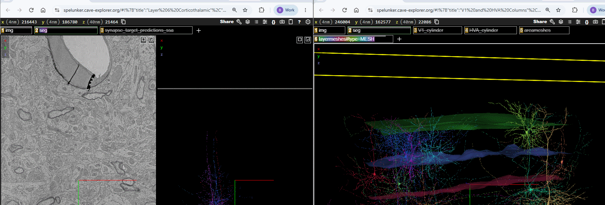
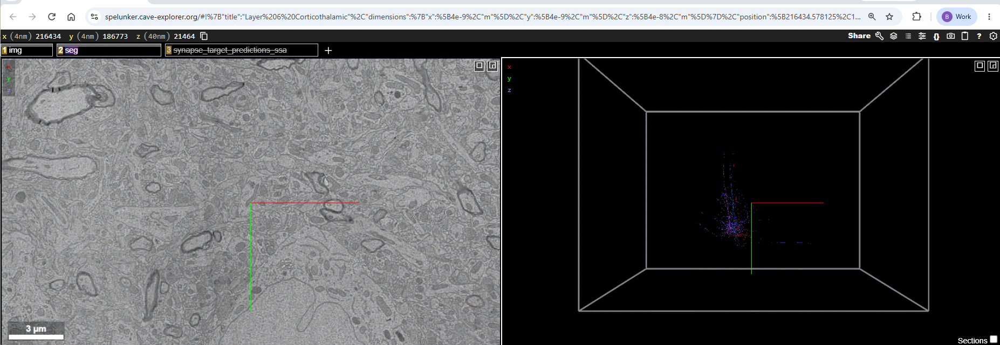

Each module's Neuroglancer scene includes several **optional layers** in addition
to the electron-microscopy imagery and the neuron segmentation. They appear as
tabs across the top of the viewer;  a tab to toggle the
layer on or off, and  a tab to open its
settings.

There are two kinds of optional layer:

- **Hosted layers** load from a public data source (a `precomputed://` path), so
  they can be added to any scene by pasting that path.
- **Local annotation layers** (points or lines) are drawn directly into a
  specific scene and have no source path — the only way to reuse one is to drag
  it from a scene that already contains it.

The [layer catalogue](#layer-catalogue) below lists every optional layer, what it
shows, its source path (for hosted layers), and an example scene you can open to
see it or drag it from. First, the two ways to add a layer to your own scene.

## Adding a layer by dragging between windows

You can copy **any** layer — hosted *or* local — from one Neuroglancer window into
another by dragging its layer tab. This is the only way to reuse a local
annotation layer (the column boundaries, organelle markers, and `KnownInputs`),
since those have no source path.

1. Open two Neuroglancer windows: the scene that has the layer, and the scene you
   want to add it to.
2.  and hold the layer's tab in the top bar of the source
   window, then drag it onto the top bar of the destination window and release.

## Adding a hosted layer

To add a hosted (`precomputed://`) layer using its source path:

1. Click the **`+`** at the top of the viewer to create a new layer.
2. Paste the layer's source path (from the catalogue) into the box that says
   *"Enter a layer source..."* and press .
3. Neuroglancer picks the layer type automatically (imagery, segmentation, or
   mesh). Meshes appear once you toggle them on.

# Layer catalogue

## Reference meshes

3D surfaces that provide anatomical context around the neurons.

| Layer | Shows | Source (paste to add) |
|---|---|---|
| **Cortical layer boundaries** (`layermeshes`) | The boundaries between cortical layers — L1/L2‑3, L2‑3/L4, L4/L5, L5/L6, and L6/white matter (six surfaces). | `precomputed://gs://allen-minnie-phase3/layermeshes_smooth_v2#type=MESH` |
| **Cortical area boundaries** (`areameshes`) | Rough boundaries between primary visual cortex (V1) and the higher-order visual areas (HVA). | `precomputed://gs://allen-minnie-phase3/areameshes#type=MESH` |

*How they were generated:* meshed from the corresponding layer/area boundary
segmentation for the MICrONS volume (Allen `minnie-phase3`).

*Example scenes:* [Cortical Layers](https://spelunker.cave-explorer.org/#!gs://microns-static-links/mm3/education/module-1-cortical-layers.json) (`layermeshes`) · [V1 and HVA Columns](https://spelunker.cave-explorer.org/#!gs://microns-static-links/mm3/education/module-1-v1-hva-columns.json) (`layermeshes` + `areameshes`).

## Column boundary annotations

| Layer | Shows | Source |
|---|---|---|
| **`V1_cylinder`** | The cylindrical boundary of the sampled V1 cortical column (blue points). | Local annotation — drag from the example scene |
| **`HVA_cylinder`** | The cylindrical boundary of the sampled higher-order visual area column (green points). | Local annotation — drag from the example scene |

*Example scene:* [V1 and HVA Columns](https://spelunker.cave-explorer.org/#!gs://microns-static-links/mm3/education/module-1-v1-hva-columns.json).

## Synapse layers

| Layer | Shows | Source |
|---|---|---|
| **Synapse predictions** (`synapse_target_predictions_ssa`) | Synapses onto the selected cell, colored by predicted postsynaptic compartment: **spine** (coral), **shaft** (cyan), **soma** (gray). Filters to the selected cell; off by default in Module 4. | `gs://keith-dev/ng_precomputed_annotations/synapses/mat-v1300_w_types_idx-v1/` |
| **`KnownInputs`** | Input synapses onto the displayed neuron whose presynaptic partner is a proofread cell, colored by target compartment (spine / shaft / soma) via tags. | Local annotation — drag from the example scene |

*How they were generated:* the synapse-prediction layer is a static, precomputed
export of the v1300 synapse table with target-type predictions. `KnownInputs` was
built from a CAVE query for input synapses whose presynaptic partner is proofread
(`proofreading_status_and_strategy`), restricted to partners valid at the v1300
materialization version.

*Example scenes:* [Spine Walkthrough](https://spelunker.cave-explorer.org/#!gs://microns-static-links/mm3/education/module-3-spine-walkthrough.json) (`synapse_target_predictions_ssa`) · [Known Inputs](https://spelunker.cave-explorer.org/#!gs://microns-static-links/mm3/education/module-3-known-inputs.json) (`KnownInputs`).

## Organelle annotations (Module 2)

Small local point layers marking example locations of a subcellular structure,
for identification practice: `Nucleus`, `Mitochondria`, `Smooth ER`, `Golgi`,
`Microtubules`, `Cilia`, `Myelinated axons`, and `Synapses`. Each is a local
annotation — drag it from the example scene.

*Example scene:* [Organelles](https://spelunker.cave-explorer.org/#!gs://microns-static-links/mm3/education/module-2-organelles.json).

## CCF context layers (Module 1 overview)

The Module 1 overview scene places the MICrONS volume inside the whole mouse brain
using the Allen Common Coordinate Framework (CCF).

| Layer | Shows | Source (paste to add) |
|---|---|---|
| **`average_template_10_8bit`** | The Allen CCF average-template mouse brain (grayscale imagery). | `precomputed://gs://allen_neuroglancer_ccf/average_template_10_8bit` |
| **`AllenCCF`** / **`ccf_outline`** | CCF brain-region meshes and the whole-brain outline. | `precomputed://gs://allen_neuroglancer_ccf/ccf_test1` |
| **`seg35`** | The MICrONS `minnie35` segmentation (a second, smaller EM volume). | `precomputed://gs://iarpa_microns/minnie/minnie35/seg` |

::: {.callout-note}
The CCF overview scene is being revised, so it is not yet published to the layer
bucket. The sources above are listed for reference; their exact configuration may
change in a future update.
:::
