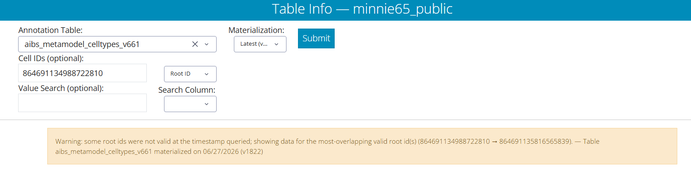

This page records changes to the education modules and coding tutorials. The
version and date shown at the top of each module correspond to the entries below.

## v1.2 — September 2026

### Neuroglancer scenes and segmentation

- **Stable, hosted scenes.** Every module's Neuroglancer link now loads a static
  scene hosted in a public cloud bucket rather than a link-shortener state. The
  links are permanent and no longer depend on the state server.
- **Pinned to one dataset version.** All scenes now use the flat (static)
  segmentation for a single materialization version (v1300) instead of the
  dynamic segmentation layer, so every module shows the same, consistent state of
  the data.
- **Consistent look.** Imagery shading, segment opacity, axis lines, and the 3D
  view are now standardized across scenes.
- **Updated neuron IDs (Module 1).** The V1/HVA column exercise now lists the
  root IDs as they exist in v1300. Root-ID lists are also **comma-separated** so
  they can be pasted directly into the dash apps (Neuroglancer accepts either,
  but the dash apps expect commas).
- **Synapse layer (Module 4).** The cell-type scenes now include a static v1300
  synapse-prediction layer. It is **off by default** — turning it on is part of
  the exercise.

### Module 2 — Organelles

- Moved Synapse-1 to reflect a typical synapse.

### Module 3 — Known Inputs

- The Known Inputs annotations now include only inputs whose presynaptic partner
  is a valid, proofread cell at v1300 (333 of the original 355 are retained).

### Dash apps

- **Table Viewer now auto-resolves root IDs.** When a pasted root ID is not valid
  at the queried materialization version, the Table Viewer automatically looks up
  and shows data for the most-overlapping valid root ID, and displays a warning
  noting the substitution. This means an out-of-date root ID will still return
  the intended cell.

### New resource pages

Two reference pages were added under the **Resources** menu:

- **[Layer Catalogue](optional-layers.qmd)** — every optional Neuroglancer layer used
  across the modules (reference meshes, column boundaries, synapse layers, organelle
  markers, CCF context), what each shows, and how to add it to a scene.
- **[Troubleshooting FAQ](faq.qmd)** — common issues: recommended browser, login and
  Terms of Service, why scenes may not render, dataset versions, static vs. dynamic
  (Graphene) segmentation, and the Dash-App root-ID warning.

## v1.1 — July 2026

- Added troubleshooting guidance for Neuroglancer login and the MICrONS Terms of
  Service.
- Added support links (Report Issue, Join Discussion) to the navigation bar and
  module pages.
- Added version information to each module page.

## v1.0

- Initial release of the four education modules and the coding tutorials.
